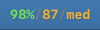
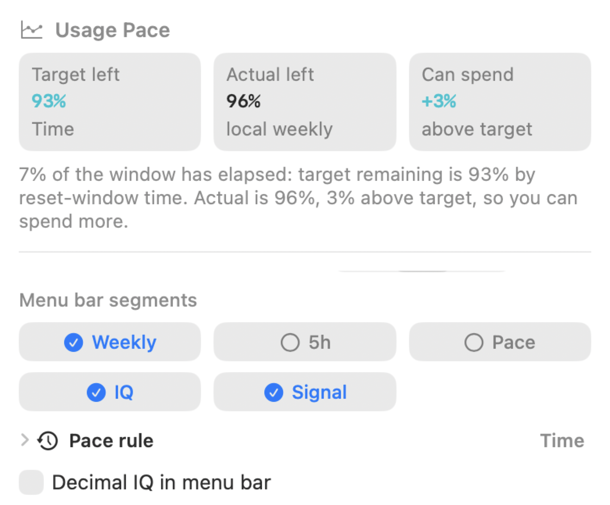
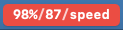
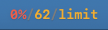
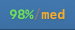
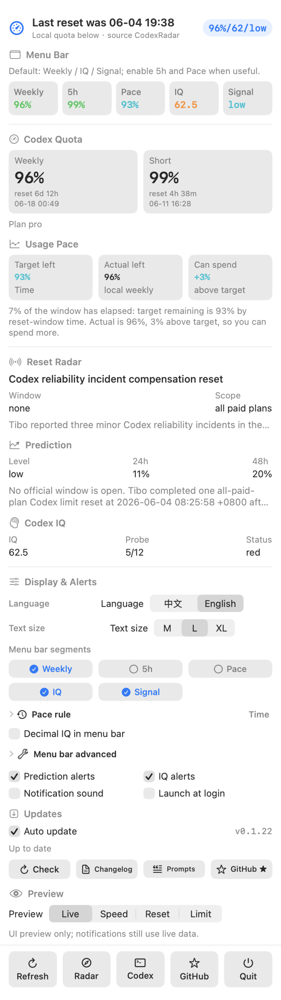

# Codex Radar Sentinel

[中文](README.md) | English

Full credit to [CodexRadar](https://codexradar.com/): this project depends on CodexRadar's public signals for Codex speed windows, resets, reset prediction, RSS events, and model IQ. Codex Radar Sentinel is a local macOS menu bar app that brings those public CodexRadar signals together with the user's local Codex quota state.

## Prompt Log

We also open-sourced the product prompts behind this app: [Prompt Log](PROMPTS.md). It preserves the user's product requests and UI feedback while removing timestamps, local paths, screenshot cache paths, and security-sensitive environment details.



## News

<details>
<summary><strong>v0.1.22: Pace rules are easier to click</strong> - Click a rule card to switch, without relying on an unreliable menu picker inside the menu bar panel.</summary>



- `Pace` compares target remaining with actual weekly quota remaining, then tells you whether there is room to spend more or slow down.
- New rules: `Time`, `Daily`, `Reserve`, `Workdays`, and `Front-load`.
- The rule guide stays collapsed by default. Expand it, then click any rule card to switch and see its formula, refresh granularity, and best-use explanation.

</details>

## Install With Codex

If you use the Codex desktop app, you can copy this prompt into Codex. Grant Codex network access, shell execution, and permission to write to `/Applications`; if macOS asks for notification permission, allow it.

```text
Directly install Codex Radar Sentinel: download latest macOS package from https://github.com/WineChord/codex-radar/releases/latest, install to /Applications, launch, confirm menu bar; ask for permissions if needed.
```

## Menu Bar Meaning

The menu bar title is intentionally compact:

```text
96%/62/low
```

The three values are:

- `96%`: weekly Codex quota remaining.
- `62`: Codex IQ score. The menu bar truncates it to a whole number by default to save space; the Codex IQ section in the dropdown shows the precise value, such as `62.5`.
- `low`: reset / speed-window signal from CodexRadar.

The `Menu bar segments` setting can also enable:

- `5h`: adds the 5-hour short-window quota to the menu bar. It is off by default; when enabled, the title looks like `96%/99%/62/low`.
- `Pace`: adds the weekly quota that should remain at the current point in the reset window. It is off by default; English shows it as `R80%`.

`Pace rule` is collapsed by default. Expand it, then click any rule card to switch; the app explains each rule's formula, refresh granularity, and best use case.

`Menu bar advanced` is collapsed by default. When expanded, it can tune the separator, side padding, font scale, IQ `/10` display, and whether `%` is kept in the menu bar. These settings only affect the menu bar title; dropdown values stay complete.

When [CodexRadar](https://codexradar.com/) reports an active speed window, the menu bar item turns red with white text. The red emphasis can be dismissed manually; it also clears when the window closes or after the 30-minute emphasis window expires.

## Status States

These screenshots are real macOS menu bar captures. The script launches the real app, switches preview states, and crops only this app's menu bar item. They are not hand-drawn mocks and do not include other menu bar icons.

| Normal | Speed window | Limit reached | Custom |
| --- | --- | --- | --- |
|  |  |  |  |

You can choose which values appear in the menu bar. For example, if you do not care about IQ, show only `96%/low`.
If you care about the 5-hour short window, enable `5h`; it appears as an extra percentage between weekly quota and IQ.
If you want to pace weekly quota evenly across the reset window, enable `Pace`.
Turn on `Decimal IQ in menu bar` if you want the menu bar itself to show the precise IQ value.

## Full Menu

This image is captured by the app itself from the real SwiftUI menu window on a high-resolution screen, and it is maintained together with the menu bar screenshots and News crop by `./scripts/update_readme_screenshots.sh`. The README displays it at 390px wide so it stays readable without taking over the page; open the source image for the full-resolution view.



## What It Shows

- Weekly Codex quota remaining, read from the local Codex app-server.
- Short-window quota remaining, also from the local Codex app-server.
- Usage pace: the suggested remaining percentage based on the selected strategy, compared with actual weekly quota remaining. For example, if target remaining is 80% and actual remaining is 90%, it tells you there is room to spend more.
  Strategies include: `Time` for smooth even spending; `Daily` for day-level budgeting; `Reserve` to keep a 20% buffer early; `Workdays` for heavier weekday usage and lighter weekends; `Front-load` to spend earlier and avoid unused quota near reset.
- [CodexRadar](https://codexradar.com/) current speed-window and reset status.
- [CodexRadar](https://codexradar.com/) 24h and 48h reset prediction.
- Codex IQ from the daily probe.

The app defaults to Chinese. English can be selected in the dropdown. Technical terms such as Codex, IQ, Reset, Prediction, and Radar are kept in English where they are clearer.

## Notifications

The app sends macOS notifications for:

- Speed window opened.
- CodexRadar records a reset; the header says `Last reset was ...`, while local quota stays in `Codex Quota`.
- Weekly quota falls below 30%.
- Weekly quota falls below 15%.
- Weekly quota recovers after a low-remaining state.
- Prediction rises to high, or CodexRadar explicitly marks it as should_notify.
- Codex IQ enters red or falls below 80.

Notification sound is off by default and can be enabled in the dropdown. Historical reset windows are seeded on first launch, so starting the app after a reset does not replay old reset notifications. If the first launch happens during an active speed window, it still notifies.

## Updates

Automatic updates are on by default. The app checks once 5 seconds after launch, then every 6 hours checks the latest GitHub Release, downloads the ZIP, verifies the release SHA256, replaces the installed app bundle, and reopens itself.

If download, verification, or installation fails, the app keeps the current version running and shows the failure in the menu. The installer also backs up the old app first; if replacement fails, it restores and reopens the old app. Automatic updates pause short-term retries for the same failed version, while manual `Check` can retry immediately.

The bottom toolbar always includes `Refresh`, `Radar`, `Codex`, `GitHub`, and `Quit`, so common jumps do not require scrolling.

The update section also includes:

- `Check`: manually checks and installs a newer release.
- `Changelog`: opens the latest release notes.
- `Prompts`: opens the open-source prompt log.
- `GitHub ★`: opens the repository page.

Turn off `Auto update` in the dropdown if you prefer manual updates only.

## Codex Skill

This repository includes a repo-managed skill: [CodexRadar Sync](skills/codex-radar-sync/SKILL.md). When the CodexRadar page or JSON payload shape changes, ask Codex to run this skill. It checks the latest CodexRadar homepage and public endpoints, compares field changes, updates Swift decoding and macOS menu mappings, and runs the full UI/data release check before shipping.

## Preview Mode

Use the `Preview` segmented control in the dropdown to inspect local UI states:

- `Live`: real data.
- `Speed`: urgent speed-window UI, including the red menu bar item and red banner.
- `Reset`: CodexRadar-recorded reset UI.
- `Limit`: local quota-limit UI.

Preview mode only changes what the app displays. Notifications and persisted event memory still use live data.

For scripted UI checks, launch with:

```bash
CODEX_RADAR_PREVIEW=speedWindow swift run CodexRadarSentinel
```

Accepted values are `live`, `speedWindow`, `resetConfirmed`, and `blocked`.

## Data Sources

Codex Radar Sentinel reads these public CodexRadar endpoints:

- [CodexRadar homepage](https://codexradar.com/)
- [current.json](https://codexradar.com/current.json): speed-window, reset, Prediction, and model IQ data.
- [feed.xml](https://codexradar.com/feed.xml)

For local quota, it reads the Codex app-server:

```json
{"method":"account/rateLimits/read"}
```

It selects the `rateLimitsByLimitId.codex` bucket when present. The 5-hour bucket is shown as `Short`; the 10,080-minute bucket is shown as `Weekly`.

## Manual Install

Download the latest `.dmg` from GitHub Releases, open it, and drag `Codex Radar Sentinel.app` into `Applications`.

The `.zip` asset contains the same app bundle for users who prefer to copy it manually.

## Run Locally

Build a normal macOS `.app` bundle:

```bash
./scripts/build_app.sh
open ".build/Codex Radar Sentinel.app"
```

You can also run the executable directly during development:

```bash
swift run CodexRadarSentinel
```

If Codex is installed somewhere other than the default app path, set:

```bash
CODEX_RADAR_CODEX_PATH=/path/to/codex
```

## Development

Run the test suite:

```bash
swift test
```

Run live data and UI checks before a release:

```bash
./scripts/check_release_readiness.sh 0.1.22
```

Build release packages:

```bash
swift build -c release
./scripts/build_app.sh
./scripts/package_release.sh 0.1.22
```

Update README menu bar and menu screenshots:

```bash
./scripts/update_readme_screenshots.sh
```

This script launches the real app and crops the macOS menu bar item. It also asks the app to render the full menu from its real SwiftUI view, then crops the compact News image. The Mac must allow System Events accessibility access and screen capture.

Regenerate the macOS icon:

```bash
./scripts/generate_app_icon.sh
```

## Credits

Codex Radar Sentinel exists because [CodexRadar](https://codexradar.com/) publishes clear public signals for Codex speed windows, resets, reset prediction, RSS events, and model IQ. This app wraps those public signals together with the user's local Codex quota state in a macOS menu bar tool.

Codex Radar Sentinel is not affiliated with CodexRadar or OpenAI.
