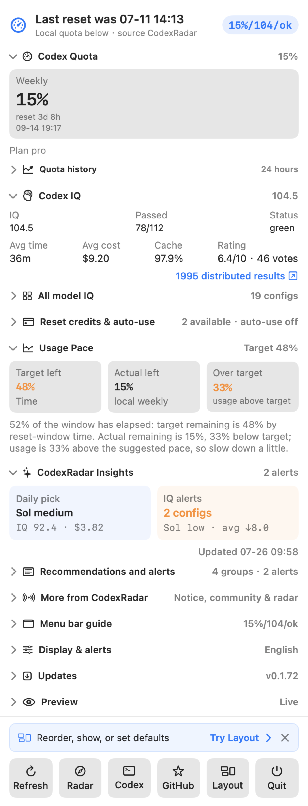

# Codex Radar Sentinel

[中文](README.md) | English

A menu bar app for macOS 13 and later. It brings local Codex quota, usage pacing, reset-credit status, and public model-quality signals from [CodexRadar](https://codexradar.com/) into one compact, configurable panel.


[Latest release](https://github.com/WineChord/codex-radar/releases/latest) · [Features](#core-features) · [Privacy and security](#privacy-and-security) · [Run from source](#run-from-source)

## Install With Codex

> **Recommended:** Send the text below to the Codex desktop app to download, verify, install, launch, and confirm the current version.

```text
Please install the latest stable release of Codex Radar Sentinel.
Release page:
https://github.com/WineChord/codex-radar/releases/latest
Download the macOS package and SHA256 file, verify the package, install the app in /Applications, launch it, and confirm that the version shown in the menu matches the latest Release. If macOS needs my approval for a permission, explain why and let me confirm it.
```

Installation requires network access and permission to write to `/Applications`. On first launch, macOS may ask for notification permission; allow it to receive quota, Model IQ, and reset-credit auto-use alerts.

You can also install manually from [GitHub Releases](https://github.com/WineChord/codex-radar/releases/latest).

## News

### v0.1.59: Arrange the menu around your workflow

- The default hierarchy still keeps the current result, local quota, Codex IQ, reset-credit summary, and usage pace easy to find.
- Choose `Layout` to drag sections or use the move-up and move-down buttons, then set which sections open by default. Preferences persist when the menu reopens and after an app restart.
- The current result, urgent alerts, and connection errors remain fixed. Reset-credit or update detail opens temporarily when it needs attention, and the default layout is always one click away.

### v0.1.58: Pass counts stay on one line

- Values such as `78/112` in `All model IQ` no longer split across lines at larger text sizes, making comparisons easier to scan.
- The IQ, Passed, and Rating columns stay on one line across M, L, and XL while preserving room for model names in both interface languages.
- The SHA256 manifest uses filenames from the download directory, so manual package verification no longer depends on repository paths.

### v0.1.57: Core information first

- The panel now leads with the current conclusion, local quota, Codex IQ, and usage pace. The complete `All model IQ` table expands directly beneath the IQ summary.
- Notices, community notes, and detailed radar sections share one `More from CodexRadar` disclosure. Reset credits, the menu-bar guide, and display settings also use clear collapsed-by-default entries.
- Critical alerts remain fixed at the top. Reset-credit detail opens automatically for blocked, missed, or unresolved attempts, so only routine state stays out of the way.

<details>
<summary><strong>Earlier releases</strong> — expand for previous product milestones</summary>

- **v0.1.56**: accepts a missing temporary notice as a normal empty state without interrupting other live data.
- **v0.1.55**: added scenario recommendations and degradation alerts while retaining the last valid result through network or schema failures.
- **v0.1.54**: prevented normal clock synchronization from disabling reset-credit auto-use and made unresolved attempts reconcile read only first.
- **v0.1.53**: completed 19 Intelligence Efficiency configurations, clarified overuse wording, and added explicitly enabled, default-off auto-use before reset credits expire.
- **v0.1.52**: added distributed Model IQ with consistent per-task cost, runtime, pass count, and community-rating semantics.
- **v0.1.51**: hides the 5h window while paused and restores it automatically when available.
- **v0.1.50**: added Standard versus Fast comparisons for E2E, TTFT, and TPS.
- **v0.1.49–v0.1.45**: improved community cards, official-window detection, local quota discovery, restore alerts, and site notices.
- **v0.1.44–v0.1.40**: unified expandable text and added manual plus low-frequency automatic reset-credit expiry checks.
- **v0.1.39–v0.1.35**: improved reset-credit guidance, Reset Radar, Quota Radar, and multi-model IQ.
- **v0.1.34–v0.1.30**: strengthened schema compatibility, workday pacing, notification cooldowns, and network timeout handling.
- **v0.1.29–v0.1.23**: added cost, runtime, cache, and rating details while making collapsed sections easier to use.
- **v0.1.22–v0.1.17**: added multiple pacing strategies and more compact menu-bar customization.
- **v0.1.11–v0.1.0**: established short-window display, automatic updates, and the original menu-bar dashboard.

See [GitHub Releases](https://github.com/WineChord/codex-radar/releases) for the complete version history.

</details>

## Core Features

| Feature | What it does |
| --- | --- |
| Local quota | Shows weekly Codex quota and, when explicitly returned, the 5h short window. |
| Usage pacing | Compares actual remaining quota with a target and says whether usage is ahead, on pace, or behind. |
| Model IQ | Shows current IQ and quality, plus public multi-model cost, runtime, pass count, and ratings. |
| Radar signals | Combines Reset Radar, Quota Radar, Fast Radar, scenario recommendations, and degradation alerts. |
| Reset-credit status | Checks each reset credit at a low frequency and caches only sanitized results. |
| Auto-use before expiry | Strictly off by default; only an explicit opt-in allows an attempt near a target credit's expiry. |
| Alerts and updates | Notifies for quota, recovery, low IQ, and auto-use results; verifies update assets with SHA256. |
| Personalization | Supports two interface languages, font sizes, section order, default expansion, menu-bar segments, and display formats. |

## Menu Bar Meaning

The default title stays intentionally short:

```text
96%/112/ok
```

| Segment | Meaning |
| --- | --- |
| `96%` | Local weekly Codex quota remaining. |
| `112` | Codex IQ; the menu bar uses a whole number by default while the panel keeps the precise value. |
| `ok` | CodexRadar model-quality state; low IQ appears as `low`. |

Optional segments and controls include:

- `5h`: available when local Codex returns a 5-hour short window and hidden automatically while paused.
- `Pace`: shows the weekly quota that should remain now, such as `R80%`.
- `Decimal IQ in menu bar`: keeps the precise IQ in the title.
- `Menu bar advanced`: adjusts separators, side padding, font scale, `/10` style, and percent signs.

## Status States

These images are rendered by the app in an isolated preview environment. They contain no live account data or unrelated menu-bar content.

| Normal | Low IQ | Limit reached | Custom |
| --- | --- | --- | --- |
|  |  |  |  |

## Full Menu



The default order leads with the current conclusion, local quota, Codex IQ, reset-credit summary, usage pace, and Insights. Notices, community notes, radar detail, and low-frequency settings stay collapsed until requested. Critical alerts remain visible, and reset-credit or update detail opens automatically when it needs attention. Refresh, Radar, Codex, GitHub, Layout, and Quit stay fixed at the bottom.

## Using the App

### Menu layout

Choose `Layout` in the bottom toolbar to customize top-level sections. Drag a handle or use the move-up and move-down buttons to change the order, then choose which sections are expanded by default. Preferences persist when the menu reopens and after an app restart. Expansion choices for `All model IQ` and Insights detail persist independently. `Restore default layout` resets only layout preferences, not language, text size, alerts, or automatic updates.

The current result, urgent alerts, and connection errors are not sortable. Reset-credit or update sections temporarily lock open when they need attention, then return to the user's saved preference after the issue clears.

### Usage pacing

`Pace rule` is collapsed by default. Expand the row to choose:

- `Time`: spread usage smoothly across the reset window.
- `Daily`: advance with local-calendar daily budgets.
- `Reserve`: keep a 20% buffer early in the window.
- `Workdays`: use more on workdays and less on weekends and public holidays.
- `Front-load`: use more in the first half to reduce unused quota near reset.

Pacing cards use unsigned percentages with an explicit direction. When actual usage is 33% above the target, the card says `33% over`, never an ambiguous negative number.

### Reset credits and auto-use before expiry

`Reset credits & auto-use` is collapsed by default and shows the available count or current execution state in its row. Expand it for full details, switches, and recovery actions. Reset-credit expiry refreshes at launch or when the cache is more than six hours old. Automatic checks can be disabled, and a manual refresh is always available. Failures keep the previous cache and distinguish sign-in, expired-session, network, and data-format issues.

`Auto-use reset credits before expiry` is a separate switch and is strictly off by default. Before enabling, the app explains the irreversible action and requires explicit confirmation. Authorization covers only supported credits that are visible and have a clear expiry at that moment. Plan checks are read only and never consume a credit.

The app attempts to use the earliest target only when it is about 30 minutes from expiry. Auto-use turns itself off when account, credit-set, or clock-continuity changes cannot be verified safely. Network loss, shutdown, sleep, quitting the app, or the absence of resettable usage can still prevent execution, so this is best effort rather than a guarantee. Enabling `Launch at login` is recommended.

### Notifications

The app can notify when:

- weekly quota falls below 30% or 15%;
- weekly quota recovers from a low state;
- Codex IQ enters red or falls below 80;
- reset-credit auto-use succeeds or needs account, authorization, clock, or unresolved-result attention;
- a legacy compatibility source reports an explicit historical window or reset event again.

Notification sound is off by default and can be enabled separately.

### Updates

Automatic updates are on by default. The app checks after launch and every six hours, downloads the latest GitHub Release, verifies its SHA256, replaces the installed app, and reopens it.

If verification or installation fails, the current version stays in place and the menu explains why. Automatic retries for the same version cool down briefly, while `Check for Updates` remains available immediately.

## Privacy and Security

- Local quota comes from the local Codex app-server and is not uploaded to CodexRadar.
- Reset-credit expiry checks use the local Codex sign-in state only for the corresponding ChatGPT request. Credentials are not cached, logged, or sent to CodexRadar or GitHub.
- Local cache stores only credit status, issue time, expiry time, and sanitized identifiers—never access tokens, cookies, email addresses, or full credit IDs.
- Auto-use before expiry works only after explicit opt-in and binds authorization to the current account and visible credit set. The target, authorization, and clock continuity are rechecked before every write.
- Uncertain results reconcile read only first. The same unresolved operation keeps one idempotency key to avoid duplicate use.
- Turning auto-use off prevents further retries or switching to another credit. A prior unresolved result must be reconciled before auto-use can be enabled again.

## Data Sources

- [CodexRadar homepage](https://codexradar.com/): notices, Reset Radar, community knowledge, Quota Radar, and model-quality summaries.
- [CodexRadar current data](https://codexradar.com/current.json): public entitlement events, Model IQ, Quota Radar, and compatibility fields.
- [CodexRadar Intelligence Efficiency data](https://codexradar.com/data/intelligence-efficiency.json): multi-model IQ, cost, runtime, and pass counts.
- [CodexRadar community ratings](https://codexradar.com/api/model-ratings): public model ratings.
- [CodexRadar Insights](https://api.codexradar.com/api/v1/radar-insights): scenario recommendations and degradation alerts.
- [CodexRadar RSS](https://codexradar.com/feed.xml): a compatibility source for public entitlement events.
- Local Codex app-server: weekly quota, short-window quota, account identity, and authoritative details needed by reset-credit auto-use.

When a public endpoint is unavailable or returns an unknown shape, the app retains the last valid public data while local quota refresh continues independently.

## Manual Install

1. Download the `.dmg` from the [latest GitHub Release](https://github.com/WineChord/codex-radar/releases/latest).
2. Open the image and drag `Codex Radar Sentinel.app` into `Applications`.
3. Launch the app and confirm the version in the update section of the menu.

The `.zip` contains the same app for manual copying or automated installation.

## Run From Source

Build a standard macOS app:

```bash
./scripts/build_app.sh
open ".build/Codex Radar Sentinel.app"
```

Run the executable during development:

```bash
swift run CodexRadarSentinel
```

If Codex is installed outside its default location:

```bash
CODEX_RADAR_CODEX_PATH=/path/to/codex swift run CodexRadarSentinel
```

## Development and Verification

```bash
swift test
swift build -c release
./scripts/check_release_readiness.sh 0.1.59
```

Build release assets:

```bash
./scripts/build_app.sh
./scripts/package_release.sh 0.1.59
```

Update the menu-bar and full-menu screenshots:

```bash
./scripts/update_readme_screenshots.sh
```

The screenshot script uses isolated, non-live previews. It does not read live account data or change the installed app's settings.

## Credits

Thanks to [CodexRadar](https://codexradar.com/) for publishing public Codex radar, model-quality, and community signals. This app combines those public signals with local Codex status in a macOS menu-bar interface.

Codex Radar Sentinel is not affiliated with CodexRadar or OpenAI.
