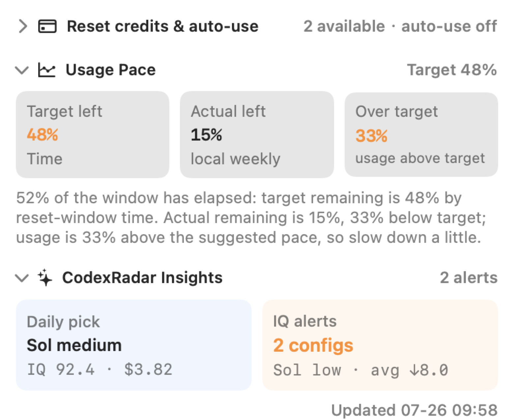

# Codex Radar Sentinel

[中文](README.md) | English

Full credit to [CodexRadar](https://codexradar.com/): this project is built on CodexRadar's public signals. CodexRadar previously published Codex speed windows, resets, reset prediction, RSS events, and model IQ; it now provides notices, reset radar, community knowledge, quota radar, Fast radar, scenario recommendations, degradation alerts, and a distributed community intelligence-efficiency radar. Codex Radar Sentinel is a local macOS menu bar app that brings the currently public CodexRadar notices, reset judgement, community knowledge, quota estimates, Fast performance comparisons, scenario recommendations, degradation alerts, Model IQ, local Codex quota state, reset-credit expiry checks, and optional expiry protection together, while keeping compatibility if the old reset/speed endpoints return.


## News

<details open>
<summary><strong>v0.1.55: Recommendations and degradation alerts</strong> - CodexRadar's new live insights show the conclusion first and expand into detail only when needed.</summary>

- A new `CodexRadar Insights` section immediately shows the daily-development pick with IQ and cost, plus the current number of degradation alerts, without requiring users to scan the full model matrix first.
- Expanding it reveals recommendations for daily development, hard problems, background automation, and lightweight long-running tasks, together with each alerted configuration's current IQ and 24h / 48h drop from its recent high. The server supplies these conclusions; Sentinel does not recompute the recommendation rules.
- The new public insights data is actively refreshed at most once every 10 minutes. Network, decoding, unknown-schema, or timestamp-regression results retain the last valid data, while the independent request cannot delay local quota, Model IQ, or other core refreshes. The feature adds neither a menu-bar segment nor notification noise.
- Decoding accepts empty recommendations, empty alerts, optional fields, and unknown categories. Only readable valid entries are shown, so placeholders or fabricated data never mask an upstream failure.

</details>

<details>
<summary><strong>v0.1.54: More reliable expiry protection</strong> - Normal clock synchronization no longer turns protection off, and unresolved requests have a clear, safe recovery path.</summary>

- On a system clock-change notification, Sentinel first revalidates the persisted wall-time and continuous-time anchors while holding the authorization lock. Consent remains active when the delta stays within the safe tolerance. Protection is turned off and requires confirmation only when the delta exceeds tolerance, continuous time resets (usually because the Mac restarted), or continuity cannot be proven. A normal app relaunch within the same boot does not trigger this state.
- Copy and controls for unresolved requests now depend strictly on protection state. While protection remains enabled, a necessary retry uses the original idempotency key for the same credit. Once protection is off, reconciliation stays read only: Sentinel never retries or switches credits, and re-enabling remains locked until the prior result is known.
- When protection is off with an unresolved request, the menu keeps `Reconcile now (read only)` available. It actively checks the server result without sending a consume request. A lost clock-continuity check now clearly says protection was turned off and requires confirmation instead of showing a generic temporary block.

</details>

<details>
<summary><strong>v0.1.53: Intelligence Efficiency and reset-credit protection</strong> - Complete the site's 19 configurations and add opt-in expiry protection.</summary>

- CodexRadar now renders 19 model/effort combinations from a separate Intelligence Efficiency source. Sentinel merges that lightweight same-origin JSON instead of stopping at the 12 rows in `current.json`.
- The menu gains public configurations such as Sol / Terra `ultra`, Terra `low` / `medium`, and Luna `low` / `medium` / `xhigh`. Each row carries IQ, passed tasks, per-task cost, and per-task time while retaining richer matching fields such as Cache from `current.json`.
- The 19-row matrix is collapsed by default behind an `Intelligence efficiency` row with a configuration count. Primary IQ, cost, and time remain immediately visible, keeping the menu compact until the full matrix is needed.
- Raw homepage HTML no longer embeds the generated model chart. If `current.json` temporarily returns HTML, the app now synthesizes Model IQ from the Intelligence Efficiency JSON so fallback does not silently disappear.
- Usage Pace no longer represents overuse as `-33%`. The card now reads `Over target 33%` with a plain-language direction, while spend-more and near-target states also use unsigned values for faster scanning.
- Adds `Reset credit expiry protection`, strictly off by default. Enabling shows an irreversible-action warning and requires explicit confirmation. A fresh Codex session verifies the login email and complete details, then authorizes only the supported expiring credits visible at that moment. When the earliest one enters its roughly 30-minute window, Sentinel attempts that exact credit through the official Codex app-server; the server authoritatively decides whether a limit can be reset.
- Every real attempt starts another fresh Codex session and rechecks the login email, complete details, status, type, expiry, and card-level authorization. Sign-out, a different email, an unapproved new credit, or loss of the verified app-server child stops the write or forces full verification again. The same unresolved logical attempt always reuses its original idempotency key and retains terminal state; only an explicit server no-op followed by read-only confirmation that the same credit remains available permits a later logical attempt when resettable usage appears. Timeout or restart reconciles first and never switches credits blindly. Discontinuity between wall time and a sleep-aware monotonic clock, including an unprovable post-reboot state, also turns protection off before a local clock jump can trigger an early use.
- `Check plan (read only)` verifies the account, detail coverage, and planned time without consuming a credit. Protection is best effort: the app must stay running, online, and signed in; sleep, shutdown, or the server finding no resettable usage can still let a credit expire.

</details>

<details>
<summary><strong>v0.1.52: Distributed Model IQ</strong> - Correct per-task cost/time and a direct distributed-radar link.</summary>

- CodexRadar's model-quality radar now aggregates distributed community runs, currently around 80-110 valid tasks per model configuration. The menu uses the clearer `Passed` label instead of the old fixed-probe wording.
- Fixes the new payload's statistics scope: the site shows per-task averages such as `$9.61 / 37m`; the app no longer displays the 109-task totals of roughly `$1047 / 67h`.
- `Codex IQ · Distributed` links to the distributed radar, while each model row adds per-task cost, time, and Cache. The menu-bar title keeps its existing compact width.
- Homepage fallback now understands the new `aria-label` chart structure, so a temporary `current.json` failure does not turn distributed IQ into `--`.
- Community ratings now require an exact model and reasoning-effort match. Missing ratings show `--` instead of borrowing another model's score.

</details>

<details>
<summary><strong>v0.1.51: Dynamic 5h compatibility</strong> - Hide 5h while paused and restore it automatically when it returns.</summary>

- CodexRadar currently describes the 5h limit as temporarily inactive, and its Quota Radar now shows only the active 7d quota.
- When local Codex does not return an approximately 300-minute window, the menu hides the short-window tile, 5h menu-bar option, and segment instead of misidentifying weekly quota as 5h.
- Compatibility remains in place: if the local API returns 5h again, the tile and option reappear without another app update.
- The CodexRadar Quota Radar follows its calibration window: it shows only 7d now and restores the 5h column if the site resumes 5h calibration.

</details>

<details>
<summary><strong>v0.1.50: Fast Radar sync</strong> - The dropdown shows Standard vs Fast public performance comparisons.</summary>

- CodexRadar added `Fast Radar`, comparing Standard and Fast across E2E, TTFT, and TPS.
- Sentinel parses the three summary metrics plus Sol / Terra / Luna per-model results from the homepage and shows them in `CodexRadar Fast Radar`.
- The method note stays collapsed as long text, and the menu bar title gets no new segment so quota and quality remain the primary glanceable signals.

</details>

<details>
<summary><strong>v0.1.49: Community knowledge cards</strong> - CodexRadar's new guide cards appear separately.</summary>

- CodexRadar's homepage community knowledge changed from a single `code prompt` to expandable guide cards, such as “How to enable Max reasoning effort”.
- The dropdown adds a dedicated `CodexRadar Community` section with dynamic `Full text` expansion, and `Reset Credit Expiry` no longer borrows titles from unrelated community cards.
- The live contract still requires community knowledge and notices to be backfilled from the homepage when `current.json` temporarily omits them.

</details>

<details>
<summary><strong>v0.1.48: Official windows no longer missed</strong> - `use_remaining_tokens` enters the speed state.</summary>

- CodexRadar's 2026-07-11 official reset window uses `use_remaining_tokens` as the machine action, even when the title does not literally say speed window.
- The menu bar now treats this open-window action as `speed`, while still excluding completed entitlement events such as `reset_completed`.
- Adds a fixture test for the “ChatGPT Work / Codex two hard resets” payload so future schema changes do not silently miss the window again.

</details>

<details>
<summary><strong>v0.1.47: Local quota display restored</strong> - No more `--` when the Codex.app bundled binary path changes.</summary>

- The Codex binary locator now checks standalone/current, `~/.local/bin/codex`, and PATH before falling back to app bundles.
- Fixes the menu bar weekly quota and 5h quota showing `--` when `/Applications/Codex.app/Contents/Resources/codex` is missing.
- Adds locator tests for environment overrides, standalone fallback, and PATH fallback.

</details>

<details>
<summary><strong>v0.1.46: Stable weekly restore alerts</strong> - Avoids false restore notifications from transient quota rollbacks.</summary>

- `Weekly quota restored` now waits for two consecutive samples with the same reset key and a remaining quota above the restored threshold.
- The pending restore candidate is persisted with app notification state; if the next poll rolls back the reset time or quota, the candidate is cleared.
- This reduces false positives when the Codex app-server briefly reports a restored weekly window and then reverts.

</details>

<details>
<summary><strong>v0.1.45: CodexRadar notices</strong> - Homepage notices now appear in the menu.</summary>

- Mirrors the `Notice` block from the top of CodexRadar, such as temporary GPT-5.6 release-probability signals.
- The notice appears near the top of the dropdown and stays compact by default; long notices reuse the dynamic `Full text` affordance.
- When a source link exists, the menu shows a clickable source button. Notices stay out of the menu bar and do not send notifications.

</details>

<details>
<summary><strong>v0.1.44: Full-text affordance only when truncated</strong> - Fully visible text no longer shows an extra control.</summary>

- `Full text / Collapse` now compares the rendered collapsed height with the rendered full height instead of relying on a rough character-count heuristic.
- If a message already fits, the dropdown simply shows the message; the full-text control appears only when the text is actually truncated.
- The same behavior is reused across Prediction, Reset Radar, Quota Radar, error details, and future summary/explanation text.

</details>

<details>
<summary><strong>v0.1.43: Expandable long text everywhere</strong> - Prediction, radar summaries, and error details can show the full text.</summary>

- Long `Prediction` reasoning now shows a `Full text` affordance so the complete summary can be expanded in place.
- Similar truncation points were audited: CodexRadar summaries, Quota Radar summaries, usage-pace notes, reset-credit guidance, failure reasons, connection errors, and update status text now share the same expand/collapse behavior.
- Future menu summaries and explanatory text should use the shared expandable component instead of exposing an ellipsis without a full-text path.

</details>

<details>
<summary><strong>v0.1.42: Auto reset-credit checks</strong> - Reset credit expiry refreshes automatically at a low frequency.</summary>

- `Reset Credit Expiry` is now on by default: it refreshes after launch and when the cache is older than 6 hours, without joining the 60-second main polling loop.
- Auto check can be turned off, and `Refresh now` still performs an immediate manual refresh. The cache stores only sanitized card status, issue time, expiry time, and ID suffixes; it never stores tokens.
- Failure states are now actionable: signed-out, expired login, network failure, and endpoint-shape changes get different next steps. Failures keep old cache, stay quiet, and do not affect menu-bar quota.

</details>

<details>
<summary><strong>v0.1.41: Expand long summaries</strong> - Truncated Reset Radar messages can be clicked to show the full text.</summary>

- Reset Radar card summaries and reason summaries stay compact by default, so the dropdown does not grow unnecessarily.
- When a message is long, a `Full text` control appears below it; click once to expand in place, then click `Collapse` to return to the compact view.
- Useful for Tibo replies, community counterexamples, and hard-reset notes that are easy to truncate.

</details>

<details>
<summary><strong>v0.1.40: Reset credit expiry</strong> - The dropdown can manually check and cache each reset credit's expiry time.</summary>

- The `Reset Credit Expiry` section adds `Check Credits`: it reads local Codex auth and requests reset credits only after you click, never as part of the 60-second polling loop.
- Results are cached locally and shown on future menu opens. The cache stores only title, status, issue time, expiry time, and a redacted ID suffix; it never stores tokens, cookies, or full unique IDs.
- Loading and failure states stay inside this section, so a failed check does not affect the menu-bar quota, CodexRadar polling, or auto-update flow.

</details>

<details>
<summary><strong>v0.1.39: Reset credit check</strong> - The dropdown now mirrors CodexRadar's reset-credit expiry check community prompt.</summary>

- Adds a `Reset Credit Check` section that copies CodexRadar's prompt for checking reset credit issue and expiry times.
- The copy path remains as a fallback, while v0.1.40 adds the in-app manual check.
- The live contract check now covers `community_knowledge`, so future CodexRadar community-card changes do not silently disappear from the menu.

</details>

<details>
<summary><strong>v0.1.38: Reset Radar alignment</strong> - The dropdown now mirrors the reset judgement restored on the CodexRadar homepage.</summary>

- Adds a `CodexRadar Reset Radar` section with the reset-card and hard-reset paths, their levels, and compact summaries.
- When `current.json` does not yet include the judgement, the app parses the public CodexRadar homepage; the menu-bar title stays compact.
- The live contract check now covers `reset_judgement`, so future CodexRadar homepage changes do not silently disappear from the menu.

</details>

<details>
<summary><strong>v0.1.37: Quota Radar alignment</strong> - The dropdown now mirrors CodexRadar's public quota estimates.</summary>

- Adds a `CodexRadar Quota Radar` section for 20x Pro / 5x Pro / Plus 5h and 7d USD-equivalent quota estimates.
- The copy makes clear that these are CodexRadar public estimates, not local remaining quota; local quota still lives in `Codex Quota`.
- The live contract check now covers `quota_radar`, so future CodexRadar field changes do not silently disappear from the menu.

</details>

<details>
<summary><strong>v0.1.36: reset payload compatibility</strong> - When current.json temporarily omits Model IQ, the app backfills IQ from the CodexRadar homepage.</summary>

- Preserves the `reset_completed / community_confirmed` entitlement state while restoring the public homepage Model IQ and multi-model table.
- `reset_completed` now also enters the “CodexRadar recorded reset” notification path instead of relying only on the old `closed_at` shape.
- Supports CodexRadar homepage Model IQ dates such as `6.29_pm`.

</details>

<details>
<summary><strong>v0.1.35: Multi-model IQ alignment</strong> - The dropdown now mirrors CodexRadar's new GPT-5.4 high and multi-model comparison view.</summary>

- The menu-bar title stays compact and still uses the primary model IQ.
- The `Codex IQ` section now includes a multi-model table for 5.5 xhigh / high / medium and 5.4 xhigh / high, with IQ, probe result, and community rating.
- This follows CodexRadar's newly visible 5.4 high monitoring, and the live contract check now covers the expanded structure.

</details>

<details>
<summary><strong>v0.1.34: Prediction level compatibility</strong> - Supports CodexRadar's newer compound prediction levels such as `medium_low` and `medium_high`.</summary>

- `medium_low` renders as `中低` in Chinese and `medium-low` in English.
- `medium_high` renders as `中高` in Chinese and `medium-high` in English.
- The Prediction section no longer falls back to `unknown` for these newer CodexRadar levels.

</details>

<details>
<summary><strong>Older releases</strong> - Expand for earlier feature history.</summary>

<details>
<summary><strong>v0.1.33: China holidays and makeup workdays</strong> - The Workdays rule now uses 2026 mainland China public holidays and makeup workdays by default.</summary>

- `Use China holidays` is on by default and only affects the `Workdays` pace rule.
- Public holidays use weekend weight `0.35`; makeup workdays use weekday weight `1`.
- The built-in 2026 State Council schedule includes Dragon Boat Festival, so `06-19` to `06-21` is treated as holiday-paced time.

</details>

<details>
<summary><strong>v0.1.32: Workday pace fix</strong> - The Workdays rule now uses local-calendar day buckets, avoiding overly high target remaining when a reset window starts mid-day.</summary>

- Weekdays weigh `1`; weekends weigh `0.35`.
- The current day counts once entered; the reset day is prorated to the reset time.
- For example, when the next reset is `06-25 10:00`, `06-18` counts as a workday budget bucket instead of only counting the few hours after 10:00.

</details>

<details>
<summary><strong>v0.1.31: Quota notification cooldown</strong> - Low weekly quota alerts are rate-limited so the same low state does not keep popping up.</summary>

- `Weekly quota low` is limited to once every 12 hours by default.
- `Weekly quota very low` is limited to once every 4 hours and still uses the stronger alert path.
- If the upstream reset timestamp slides or jitters, a changed key no longer creates repeated alerts on every 60-second refresh.

</details>

<details>
<summary><strong>v0.1.30: Polling hang guard</strong> - CodexRadar requests now time out after 15 seconds, so one stuck request cannot stop future menu-bar refreshes.</summary>

- CodexRadar has an official speed window open today, and the app correctly shows `speed` after refresh.
- Fixed a long-running app case where a stuck public endpoint request could block the next 60-second polling cycles.
- The menu bar remains compact; real windows still trigger the red speed emphasis and notification path.

</details>

<details>
<summary><strong>v0.1.29: Quality metrics aligned with CodexRadar</strong> - The dropdown now shows runtime, cost, cache hit rate, and community rating.</summary>


- CodexRadar now presents “IQ, speed, cost, cache hit rate” plus community ratings, and the menu mirrors those public metrics.
- The `Codex IQ` section now shows time, cost, Cache, and rating, for example `49m / $39.94 / 95.0% / 9.4/10`.
- The menu bar title remains `Weekly / IQ / Quality` by default, so the new metrics do not make it wider.

</details>

<details>
<summary><strong>v0.1.28: Model quality first</strong> - Speed windows are retired, so the third menu-bar segment is now Model IQ quality.</summary>


- CodexRadar now focuses on Model IQ, speed, cost, cache hit rate, and community ratings.
- The default menu bar title is now `Weekly / IQ / Quality`, for example `96%/112/ok`; low IQ shows `low`.
- The live Prediction block is hidden when CodexRadar has retired reset prediction, so old `0% / 0%` reset probabilities are no longer treated as primary information.

</details>

<details>
<summary><strong>v0.1.27: CodexRadar homepage fallback</strong> - After the old JSON/RSS endpoints were retired, Model IQ is read from the homepage.</summary>


- CodexRadar has retired reset prediction, speed-window alerts, and historical windows. If old endpoints are unavailable or return the homepage, the app falls back automatically.
- The app detects homepage HTML, extracts the latest public Model IQ, and synthesizes a compatible “no speed window” state.
- Local Codex quota, IQ, and the main menu continue to work without surfacing a JSON decoding error.

</details>

<details>
<summary><strong>v0.1.23: Collapsed rows are easier to open</strong> - Click the title, icon, or trailing status to expand; no precise chevron click required.</summary>



- `Pace rule` and `Menu bar advanced` headers are now full-row buttons.
- The chevron is only a visual hint; the title, icon, and trailing status are clickable too.
- This makes frequent menu-bar checks less fiddly on high-resolution displays.

</details>

<details>
<summary><strong>v0.1.22: Strategy cards switch directly</strong> - No unreliable menu picker inside the menu bar panel.</summary>

- `Pace` compares target remaining with actual weekly quota remaining, then tells you whether there is room to spend more or slow down.
- After expanding `Pace rule`, click any strategy explanation card to switch.
- The active strategy is highlighted and marked `Current`, so the selected rule is always visible.

</details>

<details>
<summary><strong>v0.1.21: Multiple pacing strategies</strong> - Plan weekly quota around different working styles.</summary>


- Added `Time`, `Daily`, `Reserve`, `Workdays`, and `Front-load`.
- Each rule explains its formula, refresh granularity, and best-use case.
- The optional `Pace` menu-bar segment can show target remaining directly, such as `R80%`.

</details>

<details>
<summary><strong>v0.1.19: Pace became target remaining</strong> - “How much should be left now” is easier than “how much should be used”.</summary>

- The pace section now explains `Target left`, `Actual left`, and `Can spend`.
- If target remaining is 80% and actual remaining is 90%, the app says there is room to spend more.
- This better matches how people manage a weekly quota without mental reverse math.

</details>

<details>
<summary><strong>v0.1.17: Advanced menu-bar compaction</strong> - Save status-bar space without losing readability.</summary>

<p>
  
  
</p>

- Tune separator, side padding, and font scale.
- Show IQ as raw, `/10` integer, or `/10` decimal.
- Hide `%` or keep only the segments that matter to you.

</details>

<details>
<summary><strong>v0.1.11: Optional 5h short-window segment</strong> - Weekly quota is not the only limit worth watching.</summary>

- `5h` is off by default and can be enabled manually.
- When enabled, the title can look like `96%/99%/62/low`; the second percentage is the short window.
- Useful when weekly quota is fine but the short window is the real blocker.

</details>

<details>
<summary><strong>v0.1.7: Prompt Log is open source</strong> - The product prompts, feedback, screenshot notes, and release asks are part of the repo.</summary>

- Added [Prompt Log](PROMPTS.md) for the user's direct product requests, design feedback, and verification asks.
- Timestamps, local paths, screenshot cache paths, and security-sensitive details are removed.
- Later prompts are mapped to the real commits that implemented them, with clickable commit links.

</details>

<details>
<summary><strong>v0.1.4: Automatic updates</strong> - Download, verify, replace, and reopen from GitHub Releases.</summary>

- Auto update is on by default: first check after launch, then every 6 hours.
- Release ZIPs are verified by SHA256 before replacing the app bundle.
- Failed updates keep the current app running and pause short-term automatic retries for that same version.

</details>

<details>
<summary><strong>v0.1.0: First menu-bar dashboard</strong> - CodexRadar public signals plus local Codex quota in one macOS status item.</summary>

<p>
  
  
  
</p>

- Always-on weekly quota, Codex IQ, and CodexRadar signal.
- Red menu-bar emphasis and macOS notification when a speed window opens.
- Reset events, prediction, IQ, and local quota status in one dropdown.

</details>

</details>

## Install With Codex

If you use the Codex desktop app, you can copy this prompt into Codex. Grant Codex network access, shell execution, and permission to write to `/Applications`; if macOS asks for notification permission, allow it.

```text
Directly install Codex Radar Sentinel: download latest macOS package from https://github.com/WineChord/codex-radar/releases/latest, install to /Applications, launch, confirm menu bar; ask for permissions if needed.
```

## Menu Bar Meaning

The menu bar title is intentionally compact:

```text
96%/112/ok
```

The three values are:

- `96%`: weekly Codex quota remaining.
- `112`: Codex IQ score. The menu bar truncates it to a whole number by default to save space; the Codex IQ section in the dropdown shows the precise value, such as `112.5`.
- `ok`: CodexRadar model quality status from Model IQ. Low IQ shows `low`.

The `Menu bar segments` setting can also enable:

- `5h`: appears when local Codex returns a 5-hour short window. It is off by default; when enabled, the title looks like `96%/99%/112/ok`. It is hidden automatically while the short window is paused.
- `Pace`: adds the weekly quota that should remain at the current point in the reset window. It is off by default; English shows it as `R80%`.

`Pace rule` is collapsed by default. Click the whole header row to expand or collapse it; after expanding, click any rule card to switch. The app explains each rule's formula, refresh granularity, and best use case.

`Menu bar advanced` is collapsed by default. Click the whole header row to expand or collapse it. When expanded, it can tune the separator, side padding, font scale, IQ `/10` display, and whether `%` is kept in the menu bar. These settings only affect the menu bar title; dropdown values stay complete.

CodexRadar's current homepage says speed-window alerts are retired, so live mode no longer treats speed windows or Prediction as primary signals. If the legacy compatibility endpoint returns later and reports an active window, the red speed-window emphasis still works.

## Status States

These screenshots are rendered directly from the real app's status button in isolated preview states, then placed on a fixed neutral background. Text, colors, alert backgrounds, and width all come from the implementation, without risking a capture of the installed app or other menu bar items.

| Normal | Low IQ | Limit reached | Custom |
| --- | --- | --- | --- |
|  |  |  |  |

You can choose which values appear in the menu bar. For example, if you do not care about the IQ number, show only `96%/ok`.
When local Codex returns a 5-hour short window, enable `5h` to place it between weekly quota and IQ. While paused, the app shows neither an empty value nor a duplicate of weekly quota.
If you want to pace weekly quota evenly across the reset window, enable `Pace`.
Turn on `Decimal IQ in menu bar` if you want the menu bar itself to show the precise IQ value.

## Full Menu

This image is captured by the app itself from the real SwiftUI menu window on a high-resolution screen, and it is maintained together with the menu bar screenshots and News crop by `./scripts/update_readme_screenshots.sh`. The README displays it at 390px wide so it stays readable without taking over the page; open the source image for the full-resolution view.


## What It Shows

- Weekly Codex quota remaining, read from the local Codex app-server.
- Short-window quota remaining, also from the local Codex app-server, shown only when the API explicitly returns an approximately 5-hour window.
- Usage pace: the suggested remaining percentage based on the selected strategy, compared with actual weekly quota remaining. For example, if target remaining is 80% and actual remaining is 90%, it tells you there is room to spend more.
  Strategies include: `Time` for smooth even spending; `Daily` for day-level budgeting; `Reserve` to keep a 20% buffer early; `Workdays` for heavier weekday usage and lighter weekends; `Front-load` to spend earlier and avoid unused quota near reset.
- The Reset Radar judgement visible on [CodexRadar](https://codexradar.com/): reset-card and hard-reset paths with levels, summaries, and reasons.
- The community knowledge visible on CodexRadar: the reset-credit expiry check prompt. The menu keeps copying the prompt as a fallback path.
- Local reset-credit expiry checks: low-frequency auto refresh is on by default, and `Refresh now` still runs an immediate manual refresh. The app reads the Codex access token from `~/.codex/auth.json`, requests the ChatGPT reset credits endpoint, and caches only sanitized card status, issue time, and expiry time. It never stores the token.
- Optional reset-credit expiry protection: it is off by default and, once explicitly enabled, attempts to use the earliest expiring credit through the Codex app-server inside its protection window. `Check plan (read only)` never consumes a credit.
- CodexRadar's 19 public Intelligence Efficiency configurations: Model IQ, passed tasks, per-task cost, and per-task time, plus cache hit rate when a richer source provides it.
- CodexRadar Insights: recommended configurations for daily development, hard problems, background automation, and lightweight long-running tasks, plus current 24h / 48h degradation alerts. The compact conclusion is visible by default and the complete list expands on demand.
- The Quota Radar visible on CodexRadar: currently 20x Pro / 5x Pro / Plus 7d USD-equivalent estimates, with the 5h column returning automatically if 5h calibration resumes. These are public estimates, not local remaining quota.
- The model-quality direction visible on CodexRadar: speed, cost, cache hit rate, and community ratings.
- Compatibility state for CodexRadar's legacy speed/prediction endpoints. Those are no longer treated as live primary information unless the compatibility path explicitly returns.

The app defaults to Chinese. English can be selected in the dropdown. Technical terms such as Codex, IQ, Reset, Prediction, and Radar are kept in English where they are clearer.

## Notifications

The app sends macOS notifications for:

- Weekly quota falls below 30%.
- Weekly quota falls below 15%.
- Weekly quota recovers after a low-remaining state.
- Codex IQ enters red or falls below 80.
- Enabled reset-credit expiry protection confirms that a credit is used, or needs attention because a credit expired, the login/card authorization set changed, or the system clock changed.
- If a legacy compatibility endpoint later reports a speed window, reset, or high prediction, the corresponding alert still works.

Notification sound is off by default and can be enabled in the dropdown. Historical reset windows are seeded on first launch, so starting the app after a reset does not replay old reset notifications. If the legacy compatibility endpoint returns later and the first launch happens during an explicit speed window, it still notifies.

## Updates

Automatic updates are on by default. The app checks once 5 seconds after launch, then every 6 hours checks the latest GitHub Release, downloads the ZIP, verifies the release SHA256, replaces the installed app bundle, and reopens itself.

If download, verification, or installation fails, the app keeps the current version running and shows the failure in the menu. The installer also backs up the old app first; if replacement fails, it restores and reopens the old app. Automatic updates pause short-term retries for the same failed version, while manual `Check` can retry immediately.

The bottom toolbar always includes `Refresh`, `Radar`, `Codex`, `GitHub`, and `Quit`, so common jumps do not require scrolling.

The update section also includes:

- `Check`: manually checks and installs a newer release.
- `Changelog`: opens the latest release notes.
- `Prompts`: opens the open-source prompt log.
- `GitHub`: opens the repository page.

Turn off `Auto update` in the dropdown if you prefer manual updates only.

## Codex Skill

This repository includes a repo-managed skill: [CodexRadar Sync](skills/codex-radar-sync/SKILL.md). When the CodexRadar page or JSON payload shape changes, ask Codex to run this skill. It checks the latest CodexRadar homepage and public endpoints, compares field changes, updates Swift decoding and macOS menu mappings, and runs the full UI/data release check before shipping.

## Preview Mode

Use the `Preview` segmented control in the dropdown to inspect local UI states:

- `Live`: real data.
- `Normal`: normal quality UI without a speed window.
- `Low IQ`: low model-quality UI.
- `Speed`: urgent speed-window UI, including the red menu bar item and red banner.
- `Reset`: CodexRadar-recorded reset UI.
- `Limit`: local quota-limit UI.

Preview mode only changes what the app displays. Notifications and persisted event memory still use live data.

For scripted UI checks, launch with:

```bash
CODEX_RADAR_PREVIEW=qualityLow swift run CodexRadarSentinel
```

Accepted values are `live`, `qualityNormal`, `qualityLow`, `speedWindow`, `resetConfirmed`, and `blocked`.

## Data Sources

Codex Radar Sentinel reads these public endpoints:

- [CodexRadar homepage](https://codexradar.com/): currently publishes Reset Radar judgement, reset-credit community knowledge, Quota Radar, Model IQ, and model-quality details.
- [current.json](https://codexradar.com/current.json): may currently return JSON with Quota Radar, Model IQ, official entitlement events, and legacy prediction fields. When reset judgement is not yet in JSON, the app backfills it from the homepage.
- [data/intelligence-efficiency.json](https://codexradar.com/data/intelligence-efficiency.json): lightweight same-origin data for the homepage matrix. It completes 19 model/effort IQ, cost, and time points and supplies Model IQ fallback now that raw homepage HTML no longer embeds the generated chart.
- [api/model-ratings](https://codexradar.com/api/model-ratings): community ratings. The menu's `Rating` value comes from this endpoint.
- [api/v1/radar-insights](https://api.codexradar.com/api/v1/radar-insights): public aggregated scenario recommendations and degradation alerts. Sentinel displays the server's conclusions instead of recalculating recommendation rules locally.
- [feed.xml](https://codexradar.com/feed.xml): reserved for official entitlement alerts; when unavailable or returning the homepage, the app keeps using Model IQ from the homepage/JSON.

For local quota, it reads the Codex app-server:

```json
{"method":"account/rateLimits/read"}
```

It selects the `rateLimitsByLimitId.codex` bucket when present. The 5-hour bucket is shown as `Short`; the 10,080-minute bucket is shown as `Weekly`.

For local reset-credit expiry, low-frequency auto refresh is on by default: after launch, or when the cache is older than 6 hours, it reads `~/.codex/auth.json`, sends the access token to ChatGPT's reset credits endpoint as an Authorization header, then stores only sanitized card metadata in local preferences. You can turn auto check off in the dropdown; failures show friendly guidance and keep the old cache.

`Reset credit expiry protection` is independent of that auto-check switch and is strictly off by default. Explicit enabling starts a fresh Codex app-server session. The current `account/read` protocol exposes only login type, email, and plan, so consent is bound both to a login-email fingerprint and to the fingerprints of the supported, explicitly expiring credits visible in that complete detail set. A later new credit, or a same-email workspace that exposes a different card set, requires turning protection off and explicitly enabling it again. Planning and execution use authoritative details from `account/rateLimits/read`; only after the target enters its roughly 30-minute window does the app call the official `account/rateLimitResetCredit/consume`, always with the exact target ID and an idempotency key. The full credit ID exists only in memory and is never persisted. The atomic ledger keeps only account/credit fingerprints, idempotency key, expiry, phase, and terminal state—never the token, email address, or full credit ID. Confirmed uses and still-ambiguous expired attempts retain a sanitized terminal entry. The same unresolved or ambiguous logical attempt always reuses its original key, and credit fingerprints are globally deduplicated across those active and terminal records. Only when Codex explicitly returns `nothingToReset` / `noCredit` and a read-only refresh confirms that the same credit remains available does Sentinel close that non-consuming attempt; a later logical attempt after resettable usage appears uses a new key so it does not reuse a request that may have cached the no-op result.

Every real attempt and unresolved reconciliation creates a one-shot Codex session, then performs identity verification, complete-detail validation, exact selection, request, and postflight refresh within the same app-server child and authentication snapshot. If that verified child exits before the write, the destructive call does not silently launch a replacement; it stops and requires the full verification path again. The long-lived session is used only for non-destructive dashboard hints. Enabling creates a distinct authorization generation, and the final transport write rechecks the raw credit ID's fingerprint and clock continuity while holding the authorization lock. Disabling and that write share a short process lock: if disabling completes first, the old task cannot send; if dispatch crossed the boundary first, disabling waits for the write and cannot recall it afterward. If the server returns `nothingToReset`, the credit is not consumed, and the app continues waiting only after a read-only refresh still confirms that exact credit. If a timeout, disconnect, or restart makes the result uncertain, Sentinel reconciles read only first. While protection remains enabled, a necessary retry reuses the original idempotency key for that same credit. Once protection is off, Sentinel retains the unresolved journal for read-only reconciliation only: it does not retry or switch credits, and re-enabling stays locked until the result is known or the credit expires. `Reconcile now (read only)` starts a fresh non-consuming check. Consent persists both wall time and a monotonic clock that includes sleep. A normal system clock-change notification rechecks the anchors and does not revoke consent when the observed delta remains within tolerance; normal sleep and an app relaunch within the same boot can continue too. Protection is turned off automatically and requires confirmation only when wall time diverges from continuous time beyond the safe tolerance, continuous time resets (usually because the Mac restarted), or continuity otherwise cannot be proven. Quitting, connectivity, and server state can still prevent execution, so this is best-effort protection rather than a guarantee; enabling `Launch at login` is recommended.

## Manual Install

Download the latest `.dmg` from GitHub Releases, open it, and drag `Codex Radar Sentinel.app` into `Applications`.

The `.zip` asset contains the same app bundle for users who prefer to copy it manually.

## Run Locally

Build a normal macOS `.app` bundle:

```bash
./scripts/build_app.sh
open ".build/Codex Radar Sentinel.app"
```

You can also run the executable directly during development:

```bash
swift run CodexRadarSentinel
```

If Codex is installed somewhere other than the default app path, set:

```bash
CODEX_RADAR_CODEX_PATH=/path/to/codex
```

## Development

Run the test suite:

```bash
swift test
```

Run live data and UI checks before a release:

```bash
./scripts/check_release_readiness.sh 0.1.55
```

Build release packages:

```bash
swift build -c release
./scripts/build_app.sh
./scripts/package_release.sh 0.1.55
```

Update README menu bar and menu screenshots:

```bash
./scripts/update_readme_screenshots.sh
```

This script asks isolated, non-live preview processes to render their own status buttons, then uses the app's documentation mode for the full menu and compact News image. It verifies that states, languages, and custom metrics produce distinct titles and images. It does not stop or restart a running Sentinel, read live data, request notifications, or enable reset-credit expiry protection; every preview uses temporary preferences and protection storage, with no Accessibility or Screen Recording permission required. The script uses an installed Pillow when available, or a pinned temporary copy through `uv`.

Regenerate the macOS icon:

```bash
./scripts/generate_app_icon.sh
```

## Credits

Codex Radar Sentinel exists because [CodexRadar](https://codexradar.com/) publishes clear public Codex signals. CodexRadar previously published speed windows, resets, reset prediction, RSS events, and model IQ; it now provides reset radar, community knowledge, quota radar, scenario recommendations, degradation alerts, and model quality radar. This app wraps those public signals together with the user's local Codex quota state in a macOS menu bar tool.

Codex Radar Sentinel is not affiliated with CodexRadar or OpenAI.
