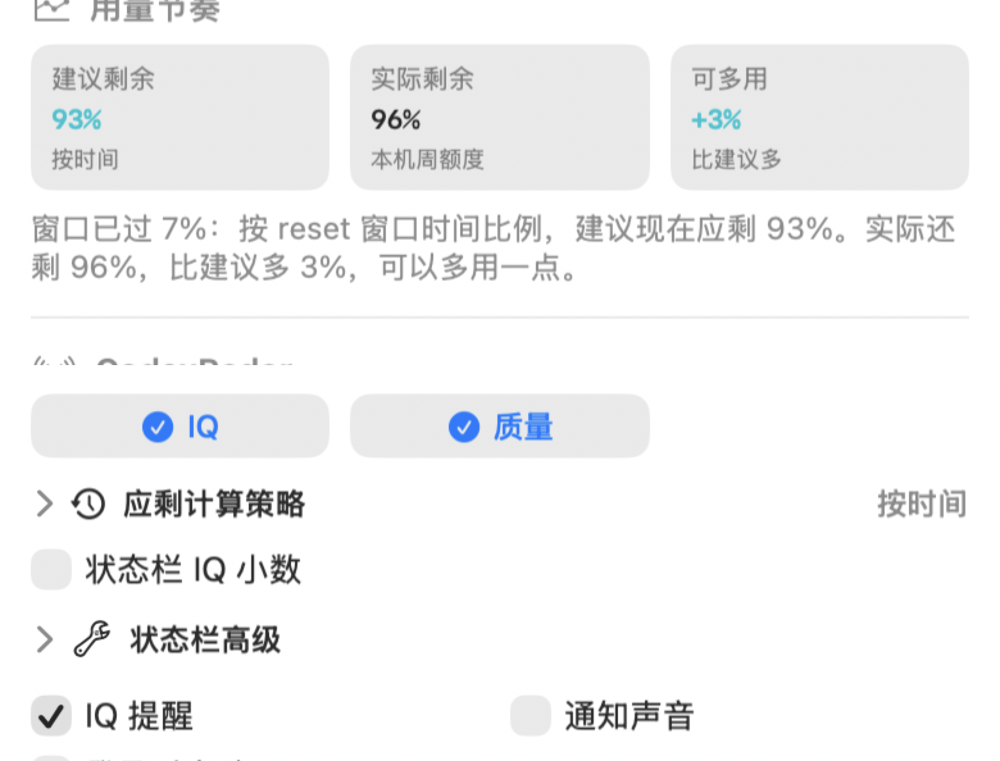

# Codex Radar Sentinel

> **Windows 10/11 支持：** 原生 Windows 右下角系统托盘版本位于 [`windows/`](windows/README.zh-CN.md)。它对齐 macOS 版的公开雷达与本机 Codex 额度功能，使用 Windows 风格面板，并支持右键退出。开发和免安装 .NET 的单文件发布方式请查看 Windows 说明。

中文 | [English](README.en.md)

首先鸣谢 [CodexRadar](https://codexradar.com/)：本项目建立在 CodexRadar 的公开信号之上。CodexRadar 早期提供 Codex 速蹬窗口、reset、reset 预测、RSS 事件和 model IQ；当前提供公告、重置雷达、社区知识分享、额度雷达与模型质量雷达。Codex Radar Sentinel 提供 macOS 菜单栏版和 Windows 10/11 通知区域版，会把 CodexRadar 当前公开的公告、reset 研判、重置卡自查知识、额度估算、Model IQ、本机 Codex 额度状态与重置卡过期查询整合到系统状态区，并保留旧 reset/速蹬接口恢复时的兼容能力。


## News / 最新功能

<details>
<summary><strong>v0.1.48：官方窗口不漏报</strong> - `use_remaining_tokens` 会进入速蹬状态。</summary>

- CodexRadar 2026-07-11 的官方重置窗口把机器信号写成 `use_remaining_tokens`，标题不一定含“速蹬”。
- 状态栏现在会把这类 open window 判为 `速蹬`，并继续排除 `reset_completed` 这类已完成权益事件。
- 新增 fixture 测试覆盖“ChatGPT Work / Codex 两次额度硬重置”payload，避免未来再次漏报。

</details>

<details>
<summary><strong>v0.1.47：本机额度恢复显示</strong> - Codex.app 内置二进制路径变化时不再显示 `--`。</summary>

- Codex 二进制定位现在会优先查找 standalone/current、`~/.local/bin/codex` 和 PATH，再回退到 App bundle。
- 修复 `/Applications/Codex.app/Contents/Resources/codex` 不存在时，状态栏周额度和 5h 短窗显示 `--` 的问题。
- 增加 locator 单测，覆盖环境变量覆盖、standalone fallback 和 PATH fallback。

</details>

<details>
<summary><strong>v0.1.46：周额度恢复提醒更稳</strong> - 避免瞬时额度回滚造成误报。</summary>

- `周额度已恢复` 通知现在需要连续两次看到同一个 reset key 且周额度仍高于恢复阈值才会发送。
- 待确认的恢复信号会随 app 状态持久化；如果下一轮额度或 reset 时间回滚，会自动清掉候选信号。
- 这能降低 Codex app-server 短暂返回高额度后又恢复旧窗口时的误通知。

</details>

<details>
<summary><strong>v0.1.45：CodexRadar 公告同步</strong> - 首页公告会出现在菜单里。</summary>

- 同步 CodexRadar 首页顶部的 `公告`，例如 GPT-5.6 发布概率这类临时公开信号。
- 公告区靠近菜单顶部，默认保持紧凑；内容过长时沿用动态 `全文` 入口。
- 有来源链接时会显示可点击来源按钮，但不进入状态栏、不发通知，避免打扰核心额度和质量判断。

</details>

<details>
<summary><strong>v0.1.44：全文入口按实际截断显示</strong> - 已经完整显示的文本不再多一个“全文”。</summary>

- `全文 / 收起` 不再只按字符数粗略判断，而是比较折叠态和全文的实际渲染高度。
- 如果当前文本已经完整显示，就只展示正文；只有真实被截断时才出现 `全文` 入口。
- 这套逻辑仍然复用在 Prediction、Reset Radar、额度雷达、错误提示和后续新增的摘要说明里。

</details>

<details>
<summary><strong>v0.1.43：长文本统一可展开</strong> - Prediction、雷达摘要和错误提示都能点开全文。</summary>

- `Prediction 预测` 的长 reasoning 摘要现在会显示 `全文`，点击即可展开完整内容。
- 系统自查了类似截断点：CodexRadar 总结、额度雷达总结、用量节奏说明、重置卡提示、失败原因、连接错误、更新状态等摘要类文本都接入同一套展开逻辑。
- 后续新增菜单摘要/说明时，应优先使用统一展开组件，避免只显示省略号却没有查看全文入口。

</details>

<details>
<summary><strong>v0.1.42：重置卡自动查询</strong> - 默认低频刷新每张 reset credit 的过期时间。</summary>

- `重置卡过期` 现在默认开启自动查询：启动后和缓存超过 6 小时时刷新一次，不接入 60 秒主轮询。
- 仍可一键关闭自动查询，也可以点 `立即刷新` 主动更新；缓存只保存脱敏卡片状态、发放时间、过期时间和 ID 后缀，不保存 token。
- 失败提示改成可操作文案：未登录、登录态过期、网络失败、接口格式变化会给出不同下一步，并且失败时保留旧缓存、不弹系统通知、不影响状态栏额度。

</details>

<details>
<summary><strong>v0.1.41：长摘要可展开</strong> - 重置雷达里的截断消息可以点击查看全文。</summary>

- `CodexRadar 重置雷达` 的路径卡片摘要和原因摘要默认仍保持紧凑，避免菜单变长。
- 当文本较长时，下方会出现 `全文`；点击后在原位置展开完整内容，再点 `收起` 恢复。
- 适合查看 Tibo 回复、社区反证、硬重置说明这类容易被截断的长消息。

</details>

<details>
<summary><strong>v0.1.40：重置卡过期时间</strong> - 下拉菜单可手动查询并缓存每张 reset credit 的过期时间。</summary>

- `重置卡过期` 区块新增 `查询重置卡`：点击后才读取本机 Codex 登录态并请求 reset credits，不接入 60 秒轮询。
- 查询结果会缓存到本机设置里，后续打开菜单直接展示；只保存标题、状态、发放时间、过期时间和脱敏 ID 后缀，不保存 token、cookie 或完整唯一 ID。
- 查询中会显示进度，失败只在该区块显示错误，不影响状态栏额度、CodexRadar 轮询或自动更新。

</details>

<details>
<summary><strong>v0.1.39：重置卡自查</strong> - 下拉菜单同步 CodexRadar 的“重置卡过期时间自查”社区知识。</summary>

- 新增 `重置卡自查` 小节，可一键复制 CodexRadar 提供的 reset credit 过期时间自查 prompt。
- 文案明确 Sentinel 只复制文本，不读取 `~/.codex/auth.json`、token 或 cookie；用户需要主动在 Codex 里运行。
- live contract 现在会检查 `community_knowledge`，避免 CodexRadar 社区知识卡结构变化后菜单静默缺失。

</details>

<details>
<summary><strong>v0.1.38：重置雷达对齐</strong> - 下拉菜单同步 CodexRadar 首页恢复的 reset 研判。</summary>

- 新增 `CodexRadar 重置雷达` 区块，展示“发重置卡”和“硬重置”两条路径的等级与摘要。
- `current.json` 暂未带 reset 研判时，会从 CodexRadar 首页解析公开研判；状态栏仍保持紧凑，不额外占位。
- live contract 现在会检查 `reset_judgement`，避免 CodexRadar 首页结构变化后菜单静默缺失。

</details>

<details>
<summary><strong>v0.1.37：额度雷达对齐</strong> - 下拉菜单同步 CodexRadar 首页新增的公开额度估算。</summary>

- 新增 `CodexRadar 额度雷达` 区块，展示 20x Pro / 5x Pro / Plus 的 5h 和 7d 美元等价值。
- 文案明确这是 CodexRadar 的公开估算，不是本机剩余额度；本机剩余仍在 `Codex 额度` 区块。
- live contract 现在会检查 `quota_radar`，避免 CodexRadar 字段变化后菜单静默缺失。

</details>

<details>
<summary><strong>v0.1.36：reset payload 兼容</strong> - current.json 临时不带 Model IQ 时，自动从 CodexRadar 首页补齐 IQ。</summary>

- 保留 `reset_completed / community_confirmed` 的权益状态，同时补回首页公开的 Model IQ 和多模型表格。
- `reset_completed` 现在也会进入“CodexRadar 记录到 reset”提醒路径，不再只依赖旧的 `closed_at`。
- 兼容 CodexRadar 首页新的 `6.29_pm` 这类 Model IQ 日期格式。

</details>

<details>
<summary><strong>v0.1.35：多模型 IQ 对齐</strong> - 下拉菜单同步 CodexRadar 新增的 GPT-5.4 high 和多模型对比。</summary>

- 状态栏仍保持紧凑，只显示主模型 IQ，不会因为多模型监控变宽。
- `Codex IQ` 区块新增多模型表格，展示 5.5 xhigh / high / medium、5.4 xhigh / high 的 IQ、探针和体感分。
- 跟随 CodexRadar 首页新增的 “5.4 high 模型监控”能力，live contract 会继续校验新结构。

</details>

<details>
<summary><strong>v0.1.34：Prediction 等级兼容</strong> - 兼容 CodexRadar 新增的 `medium_low` / `medium_high` 等复合预测等级。</summary>

- `medium_low` 显示为 `中低`，英文显示为 `medium-low`。
- `medium_high` 显示为 `中高`，英文显示为 `medium-high`。
- 避免 Prediction 区在 CodexRadar 新等级下显示“未知”。

</details>

<details>
<summary><strong>历史版本</strong> - 展开查看更早的功能记录。</summary>

<details>
<summary><strong>v0.1.33：中国节假日/调休</strong> - 工作日策略默认启用 2026 中国法定节假日和调休补班。</summary>

- `使用中国节假日/调休` 默认开启，只影响 `工作日` 应剩策略。
- 法定假日按周末权重 `0.35` 计算，调休补班按工作日权重 `1` 计算。
- 已内置 2026 国务院办公厅节假日安排，例如端午 `06-19` 至 `06-21` 会按假日节奏处理。

</details>

<details>
<summary><strong>v0.1.32：工作日节奏修正</strong> - 工作日策略改为按本机日历的天级预算计算，避免 reset 当天中途开始时建议剩余过高。</summary>

- 工作日权重为 `1`，周末权重为 `0.35`。
- 进入当天后就把当天预算计入建议用量；reset 当天按截止时刻折算。
- 例如下次 reset 是 `06-25 10:00` 时，`06-18` 当天会作为一个工作日预算参与计算，不会只按从 10 点开始的几个小时算出 `应剩 95%`。

</details>

<details>
<summary><strong>v0.1.31：周额度提醒降噪</strong> - 低额度通知增加冷却，避免同一低额度状态反复弹窗。</summary>

- `周额度偏低` 默认最多 12 小时触发一次。
- `周额度很低` 默认最多 4 小时触发一次，仍保留更强提醒。
- 如果上游 reset 时间戳在滑动或抖动，app 不会因为 key 变化在每轮 60 秒刷新里重复打扰。

</details>

<details>
<summary><strong>v0.1.30：防止轮询卡住</strong> - CodexRadar 请求增加 15 秒超时，避免一次网络卡住导致状态栏不再刷新。</summary>

- 今天 CodexRadar 官方速蹬窗口已开启，重启 app 后状态栏正确显示 `速蹬`。
- 修复长期运行时某次公开端点请求卡住后，后续 60 秒轮询可能不再继续的问题。
- 状态栏仍保持紧凑；真正开窗时会恢复红色速蹬强调和通知。

</details>

<details>
<summary><strong>v0.1.29：质量指标对齐 CodexRadar</strong> - 下拉菜单新增耗时、费用、cache 命中率和社区体感分。</summary>


- CodexRadar 当前网页展示“智商、速度、费用与 cache 命中率”和“社区体感分”，菜单已同步这些公开指标。
- `Codex IQ` 区块现在会显示耗时、费用、Cache 和体感分，例如 `49分钟 / $39.94 / 95.0% / 9.4/10`。
- 状态栏默认仍保持 `周额度 / IQ / 质量`，不会因为新增指标变宽。

</details>

<details>
<summary><strong>v0.1.28：转向模型质量雷达</strong> - 速蹬窗口已下架，状态栏第三段改成 Model IQ 质量状态。</summary>


- CodexRadar 当前聚焦 Model IQ、速度、费用、cache 命中率和社区体感分。
- 状态栏默认变成 `周额度 / IQ / 质量`，例如 `96%/112/正常`；IQ 偏低时会显示 `低`。
- 下拉菜单隐藏 live Prediction 区块，不再把 `0% / 0%` 这类旧 reset 预测当成主信息展示。

</details>

<details>
<summary><strong>v0.1.27：兼容 CodexRadar 新首页</strong> - 旧 JSON/RSS 端点下架后，自动从首页读取 Model IQ。</summary>


- CodexRadar 已将 reset 预测、速蹬窗口提醒和历史窗口下架；旧端点不可用或回到首页时，app 会自动降级。
- app 会识别首页 HTML，从公开页面提取最新 Model IQ，并合成“无速蹬窗口”的兼容状态。
- 本机 Codex 额度、IQ 和菜单主体继续可用；不会再把 HTML 当 JSON 解码错误展示给用户。

</details>

<details>
<summary><strong>v0.1.23：折叠区整行可点</strong> - 点标题文字、图标或右侧状态都能展开，不用再精确点左侧小箭头。</summary>



- `应剩计算策略` 和 `状态栏高级` 的标题行都变成整行按钮。
- 左侧箭头只是视觉提示，实际可以点标题文字、图标、右侧状态。
- 这类小交互降低了菜单栏工具的操作精度要求，尤其适合高频点开查看。

</details>

<details>
<summary><strong>v0.1.22：策略卡片可直接切换</strong> - 不再依赖菜单栏弹窗里不稳定的下拉选择器。</summary>

- `应剩` 会把建议剩余和实际剩余放在一起看，直接告诉你还能多用还是该放慢。
- 展开 `应剩计算策略` 后，点击任一策略说明卡片即可切换。
- 当前策略会有蓝色高亮和 `当前` 标记，不需要猜当前选中了什么。

</details>

<details>
<summary><strong>v0.1.21：多种应剩策略</strong> - 按不同工作习惯规划周额度节奏。</summary>


- 新增 `按时间`、`每日`、`留余`、`工作日`、`先用` 五种策略。
- 每种策略都解释公式、刷新粒度和适用场景。
- 可选把 `应剩` 放进状态栏，例如用 `应80%` 提醒现在理想剩余。

</details>

<details>
<summary><strong>v0.1.19：应剩改成建议剩余</strong> - 看“现在应该还剩多少”，比看“应该用掉多少”更直观。</summary>

- 用 `建议剩余 / 实际剩余 / 可多用` 三个卡片解释当前节奏。
- 例如建议应剩 80%、实际还剩 90%，就直接提示可以多用一点。
- 这个表达更适合控制周额度节奏，不需要用户自己反向换算。

</details>

<details>
<summary><strong>v0.1.17：状态栏高级压缩</strong> - 在不牺牲可读性的前提下减少菜单栏占位。</summary>

<p>
  
  
</p>

- 可调分隔符、左右留白、字体比例。
- IQ 可以选择原值、`/10` 整数或 `/10` 小数。
- 可以隐藏 `%`，也可以只保留自己关心的状态栏段。

</details>

<details>
<summary><strong>v0.1.11：5h 短窗可选显示</strong> - 除了周额度，也能把短窗额度放进状态栏。</summary>

- `5h` 默认关闭，需要时可以手动打开。
- 打开后状态栏可以类似 `96%/99%/62/低`，第二个百分比就是短窗。
- 适合排查“周额度还很多，但短窗先触顶”的情况。

</details>

<details>
<summary><strong>v0.1.7：Prompt Log 开源</strong> - 把产品从想法、吐槽、截图反馈到发布验证的 prompt 一起放进仓库。</summary>

- 新增 [Prompt Log](PROMPTS.md)，记录用户直接给 Codex 的产品需求、设计反馈和验证要求。
- 去掉时间戳、本地路径、截图缓存路径和安全敏感信息，只保留可公开的产品上下文。
- 后续每条 prompt 都维护到实际 commit 的映射，commit 链接可点击。

</details>

<details>
<summary><strong>v0.1.4：自动更新</strong> - 新版本可以静默下载、校验、替换并重开。</summary>

- 默认开启自动更新，启动后会检查 GitHub Release，之后每 6 小时检查一次。
- 下载后校验 SHA256，再替换 app bundle。
- 如果更新失败，会保留当前版本并短期暂停同版本自动重试，避免循环重启。

</details>

<details>
<summary><strong>v0.1.0：第一版菜单栏仪表盘</strong> - 把 CodexRadar 公开信号和本机 Codex 额度合到一个 macOS 状态栏工具。</summary>

<p>
  
  
  
</p>

- 常驻显示周额度、Codex IQ 和 CodexRadar 信号。
- 速蹬窗口开启时状态栏变红，并发送 macOS 通知。
- reset 事件、预测、IQ、额度状态都在同一个下拉菜单里看。

</details>

</details>

## 让 Codex 帮你安装

如果你正在用 Codex 桌面版，可以直接复制下面这段 prompt 给 Codex。需要允许 Codex 访问网络、执行 shell 命令、写入 `/Applications`；如果 macOS 弹出通知权限，点允许即可。

```text
直接安装 Codex Radar Sentinel：下载 https://github.com/WineChord/codex-radar/releases/latest 的最新 macOS 包，装进 /Applications，启动并确认菜单栏；需权限问我。
```

### Windows 10/11

默认安装到当前用户目录，不需要管理员权限；需要允许 Codex 访问网络、执行 PowerShell、写入 `%LOCALAPPDATA%\Programs` 和启动应用。

```text
直接安装 Codex Radar Sentinel（Windows 10/11）：先确认当前系统是 Windows 10 1809+ 或 Windows 11，并检测系统架构；仅从 https://github.com/WineChord/codex-radar/releases/latest 下载与架构匹配的 CodexRadarSentinel-<版本>-Windows-x64.zip 或 CodexRadarSentinel-<版本>-Windows-arm64.zip 及其同名 .sha256，禁止下载 .dmg、-macOS.zip 或另一架构的包；如果没有唯一匹配的 Windows 资产和校验文件，停止并告诉我，不得用其他平台或架构的包代替；校验 SHA256 和包内 platform=windows、runtime/architecture 匹配的 release-manifest.json 后，安装到 %LOCALAPPDATA%\Programs\CodexRadarSentinel，启动 CodexRadarSentinel.exe 并确认右下角通知区域出现雷达图标；需要网络、PowerShell、写入或启动权限时问我。
```

## 状态栏含义

状态栏标题刻意保持很短：

```text
96%/112/正常
```

三个值分别是：

- `96%`：Codex 周额度剩余百分比。
- `112`：Codex IQ 分数。状态栏默认截断为整数以节省空间；下拉菜单里的 Codex IQ 区块会显示精确值，例如 `112.5`。
- `正常`：CodexRadar 模型质量状态，来自 Model IQ。IQ 偏低时会显示 `低`。

下拉菜单的 `状态栏显示` 里还可以手动打开：

- `5h`：把 5 小时短窗额度也放进状态栏；默认关闭，打开后会类似 `96%/99%/112/正常`。
- `应剩`：把“按节奏现在应该还剩多少周额度”放进状态栏；默认关闭，中文显示类似 `应80%`，英文显示类似 `R80%`。

`应剩计算策略` 默认收起。点击这一整行标题即可展开或收起；展开后点击任一策略卡片即可切换，并会直接说明每个策略的公式、刷新粒度和适用场景。

`状态栏高级` 默认收起；点击这一整行标题即可展开或收起。展开后可以调分隔符、左右留白、字体比例、IQ 是否按 `/10` 显示，以及状态栏里是否保留 `%`。这些设置只影响状态栏标题，下拉菜单里的完整数值不变。

当前 [CodexRadar](https://codexradar.com/) 已说明速蹬窗口提醒下架，所以 live 模式不再把速蹬/Prediction 当作主信号。如果未来旧兼容接口恢复并报告窗口开启，红色速蹬强调仍会生效。

## 状态展示

这些截图来自真实 macOS 状态栏：脚本会启动真实 app，切换预览状态，然后裁剪本 app 的状态栏 item。不是手绘 mock，也不包含右侧其他菜单栏图标。

| 正常 | IQ 偏低 | 本机限额 | 自定义 |
| --- | --- | --- | --- |
|  |  |  |  |

可以在下拉菜单里选择状态栏显示哪些值。例如不关心 IQ 数字时，可以只显示 `96%/正常`。
如果关心 5 小时短窗，可以手动打开 `5h`，它会作为一个额外百分比插入到周额度和 IQ 之间。
如果想按 reset 窗口节奏均匀使用周额度，可以手动打开 `应剩`。
如果想让状态栏也显示精确 IQ 小数，可以打开 `状态栏 IQ 小数`。

## 完整菜单界面

这张图由 app 自己在高清屏上截取真实 SwiftUI 菜单窗口生成，和状态栏截图、News 小图一起由 `./scripts/update_readme_screenshots.sh` 维护。README 里按 390px 宽度展示，避免尺寸过大；点开原图可以看到高清细节。


## 它会显示什么

- Codex 周额度剩余，来自本机 Codex app-server。
- Codex 短窗额度剩余，也来自本机 Codex app-server。
- 用量节奏：按所选策略计算当前建议剩余百分比，并和实际周额度剩余对比；例如建议应剩 80%、实际还剩 90%，就会提示可以多用一点。
  策略包括：`按时间` 平滑均匀用完；`每日` 按天级预算推进；`留余` 前期保留 20% 缓冲；`工作日` 工作日多用、周末少用；`先用` 前半程更积极，避免 reset 前剩太多。
- [CodexRadar](https://codexradar.com/) 首页可见的重置雷达研判：发重置卡、硬重置两条路径的等级、摘要和原因。
- CodexRadar 首页可见的社区知识：`重置卡过期时间自查` prompt。菜单保留复制 prompt 作为兜底路径。
- 本机重置卡过期查询：默认低频自动刷新，也可以手动点 `立即刷新`；app 会读取 `~/.codex/auth.json` 中的 Codex access token，请求 ChatGPT reset credits 接口，并只缓存脱敏后的卡片状态、发放时间和过期时间，不保存 token。
- CodexRadar 当前公开的 Model IQ、模型质量状态和探针通过数。
- CodexRadar 首页可见的额度雷达：20x Pro / 5x Pro / Plus 的 5h 和 7d 美元等价值估算。它不是本机剩余额度，只是公开估算。
- CodexRadar 首页可见的模型质量方向：速度、费用、cache 命中率和社区体感分。
- CodexRadar 旧速蹬/预测接口的兼容状态；这些功能不再作为 live 主信息展示，只有明确恢复时才触发旧提醒路径。

应用默认中文；下拉菜单里可以切换 English。Codex、IQ、Reset、Prediction、Radar 这类英文术语会保留，因为它们在产品里更清楚。

## 通知

应用会在这些情况发送 macOS 通知：

- 周额度低于 30%。
- 周额度低于 15%。
- 周额度从低位恢复。
- Codex IQ 进入 red 或低于 80。
- legacy 兼容接口如果未来重新报告速蹬窗口、reset 或 high prediction，仍会触发对应提醒。

通知声音默认关闭，可以在下拉菜单里打开。首次启动会把历史 reset 窗口记为已见过，避免补发旧通知；如果 legacy 兼容接口未来恢复且首次启动时正好处在明确的速蹬窗口中，仍然会提醒。

Windows 版沿用相同的通知条件，通过通知区域气泡显示；系统声音仍由 Windows 通知与专注设置控制。

## 更新

自动更新默认开启。应用启动 5 秒后会先检查一次，之后每 6 小时检查一次最新 GitHub Release，下载 ZIP，校验 release 里的 SHA256，然后替换已安装的 app bundle 并自动重开。

Windows 版使用独立更新实现，只接受当前架构的精确 Windows ZIP、同名 SHA256 和 `platform=windows` 的包内清单，然后替换当前用户程序目录并重开。

如果下载、校验或安装失败，应用会保留当前版本并在菜单里显示失败原因。安装脚本也会先备份旧版；如果替换失败，会恢复并重新打开旧版。对同一个刚刚安装失败的版本，自动更新会暂停短期重试，手动 `检查更新` 仍可立即重试。

底部工具栏固定提供 `刷新`、`Radar`、`Codex`、`GitHub` 和 `退出`，方便常用跳转不用滚动菜单。

版本更新区还提供：

- `检查更新`：立刻检查并安装新版本。
- `Changelog`：打开最新 release notes。
- `Prompts`：打开开源的 prompt log。
- `GitHub`：打开仓库页面。

如果只想手动更新，可以在下拉菜单关闭 `自动更新`。

## Codex Skill

仓库里带了一个 repo 内 skill：[CodexRadar Sync](skills/codex-radar-sync/SKILL.md)。当 CodexRadar 页面或 JSON 数据格式变化时，可以让 Codex 执行这个 skill：它会检查 CodexRadar 最新主页和公开端点，比较字段变化，同时更新 Swift/macOS 与 C#/Windows 的解码、通知和界面映射，并在发版前分别执行双平台的数据、构建与包校验。

## 调试预览

下拉菜单里有 `预览` 分段控件，可以本地查看不同状态：

- `Live`：真实数据。
- `正常`：无速蹬窗口的正常质量 UI。
- `低 IQ`：模型质量偏低 UI。
- `速蹬`：速蹬窗口 UI，包括红色状态栏和红色提示。
- `Reset`：CodexRadar 记录到 reset 的 UI。
- `限额`：本机限额 UI。

预览只影响 UI 展示；真实通知和去重仍使用 live 数据。

也可以用环境变量启动：

```bash
CODEX_RADAR_PREVIEW=qualityLow swift run CodexRadarSentinel
```

可选值是 `live`、`qualityNormal`、`qualityLow`、`speedWindow`、`resetConfirmed`、`blocked`。

## 数据来源

Codex Radar Sentinel 读取这些公开入口：

- [CodexRadar homepage](https://codexradar.com/)：当前公开重置雷达研判、重置卡自查社区知识、额度雷达、Model IQ 和模型质量细节。
- [current.json](https://codexradar.com/current.json)：当前可能返回 JSON，包含额度雷达、Model IQ、官方权益事件和 legacy prediction 字段；当 reset 研判暂未进入 JSON 时，app 会从首页补齐。
- [api/model-ratings](https://codexradar.com/api/model-ratings)：社区体感分，菜单里的 `体感` 来自这里。
- [feed.xml](https://codexradar.com/feed.xml)：后续用于官方权益提醒；不可用或返回首页时，app 会继续以首页/JSON 里的 Model IQ 为准。

本机额度读取 Codex app-server：

```json
{"method":"account/rateLimits/read"}
```

当响应里存在 `rateLimitsByLimitId.codex` 时，优先使用这个 bucket。5 小时窗口显示为 `短窗`，10,080 分钟窗口显示为 `周额度`。

本机重置卡过期时间默认低频自动刷新：app 启动后、或缓存超过 6 小时时，会从 `~/.codex/auth.json` 取 Codex access token，把它作为 Authorization header 发给 ChatGPT reset credits 接口，然后只把脱敏后的卡片元数据缓存到本机偏好设置里。你可以在下拉菜单里关闭自动查询；失败时只显示友好提示并保留旧缓存。

## 手动安装

从最新 GitHub Release 下载 `.dmg`，打开后把 `Codex Radar Sentinel.app` 拖到 `Applications`。

`.zip` 里包含同一个 app bundle，适合喜欢手动复制的用户。

### Windows 10/11

请按 [Windows 安装说明](windows/README.zh-CN.md) 使用 `windows/install.ps1`，或手动校验当前架构 Windows ZIP 的同名 SHA256 和包内清单后，安装到 `%LOCALAPPDATA%\Programs\CodexRadarSentinel`。Windows 安装器会拒绝 macOS、错误架构和非预期文件。

## 本地运行

构建普通 macOS `.app`：

```bash
./scripts/build_app.sh
open ".build/Codex Radar Sentinel.app"
```

开发时也可以直接运行：

```bash
swift run CodexRadarSentinel
```

如果 Codex 不在默认路径，可以设置：

```bash
CODEX_RADAR_CODEX_PATH=/path/to/codex
```

## 开发

运行测试：

```bash
swift test
```

发版前做 live 数据和 UI 检查：

```bash
./scripts/check_release_readiness.sh 0.1.48
```

构建 release 包：

```bash
swift build -c release
./scripts/build_app.sh
./scripts/package_release.sh 0.1.48
```

更新 README 状态栏和菜单截图：

```bash
./scripts/update_readme_screenshots.sh
```

这个脚本会启动真实 app 并裁剪 macOS 状态栏 item，也会调用 app 自己的文档截图模式渲染完整菜单界面，并从完整菜单生成 News 小图。因此需要本机允许 System Events 读取辅助功能信息，并允许屏幕截图。

重新生成 macOS 图标：

```bash
./scripts/generate_app_icon.sh
```

## 鸣谢

Codex Radar Sentinel 之所以能成立，是因为 [CodexRadar](https://codexradar.com/) 持续提供清晰的公开 Codex 信号。CodexRadar 早期提供速蹬窗口、reset、reset 预测、RSS 事件和 model IQ；当前提供重置雷达、社区知识分享、额度雷达与模型质量雷达。本应用只是把这些公开信号和用户本机 Codex 额度状态整合成 macOS 菜单栏与 Windows 通知区域工具。

Codex Radar Sentinel 与 CodexRadar 或 OpenAI 没有关联。
