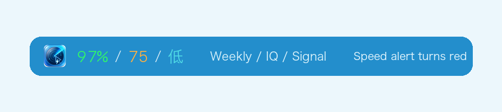
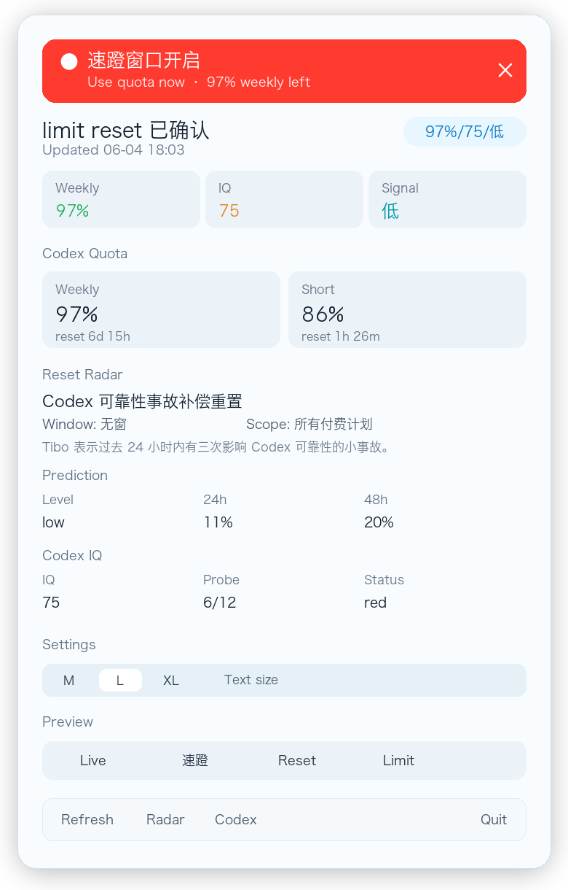

# Codex Radar Sentinel

Codex Radar Sentinel is a local macOS menu bar app for Codex usage timing. It keeps the most important signal visible without opening [CodexRadar](https://codexradar.com/) or checking the Codex usage page.





The menu bar title is intentionally compact:

```text
97%/75/低
```

The three segments are:

- `97%`: weekly Codex quota remaining.
- `75`: Codex IQ score from the daily probe.
- `低`: reset/speed-window signal from CodexRadar.

When [CodexRadar](https://codexradar.com/) reports an active speed window, the menu bar item turns red until the current alert is dismissed, the window is no longer active, or the 30-minute emphasis window expires.

## What It Shows

- Weekly Codex quota remaining, read from the local Codex app-server.
- Short-window quota remaining, also from the local Codex app-server.
- [CodexRadar](https://codexradar.com/) current speed-window and reset status.
- [CodexRadar](https://codexradar.com/) 24h and 48h reset prediction.
- Codex model IQ score from the daily probe.

The dropdown starts with a small legend for `Weekly / IQ / Signal`, then shows the detailed quota, radar, prediction, and IQ sections. Text size can be changed in the dropdown with `M`, `L`, or `XL`.

## Notifications

The app sends macOS notifications for events that should not require manual checking:

- Speed window opened.
- Codex limit reset confirmed.
- Weekly quota falls below 30%.
- Weekly quota falls below 15%.
- Weekly quota recovers after a low-remaining state.
- Prediction rises to high, or CodexRadar explicitly marks it as notify-worthy.
- Codex IQ falls into a red or sub-80 state.

Historical reset windows are seeded on first launch, so starting the app after a reset does not replay old reset notifications. If the first launch happens during an active speed window, it still notifies.

## Preview Mode

Use the `Preview` segmented control in the dropdown to inspect local UI states:

- `Live`: real data.
- `速蹬`: urgent speed-window UI, including the red menu bar item and dismissible red banner.
- `Reset`: confirmed reset UI.
- `Limit`: local quota-limit UI.

Preview mode only changes what the app displays. Notifications and persisted event memory still use live data.

For scripted UI checks, launch the executable with:

```bash
CODEX_RADAR_PREVIEW=speedWindow swift run CodexRadarSentinel
```

Accepted values are `live`, `speedWindow`, `resetConfirmed`, and `blocked`.

## Data Sources

CodexRadar Sentinel reads these public CodexRadar endpoints:

- [CodexRadar homepage](https://codexradar.com/)
- [current.json](https://codexradar.com/current.json)
- [prediction.json](https://codexradar.com/prediction.json)
- [model-iq.json](https://codexradar.com/model-iq.json)
- [feed.xml](https://codexradar.com/feed.xml), referenced as the event-feed counterpart to the JSON state.

For local quota, it starts a long-lived Codex app-server process and sends:

```json
{"method":"account/rateLimits/read"}
```

It selects the `rateLimitsByLimitId.codex` bucket when present. The 5-hour bucket is shown as `Short`; the 10,080-minute bucket is shown as `Weekly`.

## Install

Download the latest `.dmg` from the GitHub release, open it, and drag `Codex Radar Sentinel.app` into `Applications`.

The `.zip` asset contains the same app bundle for users who prefer to install manually.

## Run Locally

Build a normal macOS `.app` bundle:

```bash
./scripts/build_app.sh
open ".build/Codex Radar Sentinel.app"
```

You can also run the executable directly during development:

```bash
swift run CodexRadarSentinel
```

The bundled app is local-only. It does not need App Store publishing.

If Codex is installed somewhere other than the default app path, set:

```bash
CODEX_RADAR_CODEX_PATH=/path/to/codex
```

## Development

Run the test suite:

```bash
swift test
```

Build release artifacts:

```bash
swift build -c release
./scripts/build_app.sh
```

Build release packages:

```bash
./scripts/package_release.sh 0.1.2
```

Update README screenshots after UI changes:

```bash
./scripts/update_readme_screenshots.sh
```

Regenerate the macOS icon from the source image:

```bash
./scripts/generate_app_icon.sh
```

## Credits

Codex Radar Sentinel exists because [CodexRadar](https://codexradar.com/) publishes a clear public signal for Codex speed windows, resets, reset prediction, RSS events, and model IQ. This app is a local macOS wrapper around those public signals plus the user's local Codex quota state.

Codex Radar Sentinel is not affiliated with CodexRadar or OpenAI.
