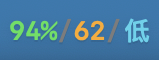
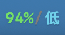
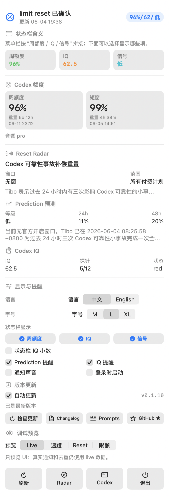

# Codex Radar Sentinel

中文 | [English](README.en.md)

首先鸣谢 [CodexRadar](https://codexradar.com/)：本项目依赖 CodexRadar 提供的公开信号，包括 Codex 速蹬窗口、reset、reset 预测、RSS 事件和 model IQ。Codex Radar Sentinel 是一个本地 macOS 菜单栏工具，把 CodexRadar 的公开信号与本机 Codex 额度状态整合到状态栏里。

## Prompt 也开源了

为了把这个小工具的诞生过程也开源出来，我们整理了从想法、吐槽、截图反馈到发布验证的用户 prompt：[Prompt Log](PROMPTS.md)。里面只保留产品需求和反馈，已隐去时间戳、本地路径、截图缓存路径和安全敏感信息，算是博大家一个开心。



## 让 Codex 帮你安装

如果你正在用 Codex 桌面版，可以直接复制下面这段 prompt 给 Codex。需要允许 Codex 访问网络、执行 shell 命令、写入 `/Applications`；如果 macOS 弹出通知权限，点允许即可。

```text
请直接帮我在这台 Mac 上安装 Codex Radar Sentinel。

要求：
1. 打开 https://github.com/WineChord/codex-radar/releases/latest
2. 下载最新的 CodexRadarSentinel-*-macOS.dmg
3. 挂载 DMG
4. 把 "Codex Radar Sentinel.app" 复制到 /Applications
5. 启动应用
6. 如果系统询问通知权限，提醒我点允许
7. 启动后读取菜单栏状态，确认它显示类似 96%/62/低、97%/62/低 或 96%/低

请直接执行安装和验证，不要只给我步骤。
```

## 状态栏含义

状态栏标题刻意保持很短：

```text
96%/62/低
```

三个值分别是：

- `96%`：Codex 周额度剩余百分比。
- `62`：Codex IQ 分数。状态栏默认截断为整数以节省空间；下拉菜单里的 Codex IQ 区块会显示精确值，例如 `62.5`。
- `低`：CodexRadar 的 reset / 速蹬信号。

当 [CodexRadar](https://codexradar.com/) 报告速蹬窗口开启时，状态栏 item 会变成红底白字。红色强调可以手动关闭；窗口结束或 30 分钟强调时间到后会自动退场。

## 状态展示

这些截图来自真实 macOS 状态栏：脚本会启动真实 app，切换预览状态，然后裁剪本 app 的状态栏 item。不是手绘 mock，也不包含右侧其他菜单栏图标。

| 正常 | 速蹬窗口 | 本机限额 | 自定义 |
| --- | --- | --- | --- |
|  |  |  |  |

可以在下拉菜单里选择状态栏显示哪些值。例如不关心 IQ 时，可以只显示 `96%/低`。
如果想让状态栏也显示精确 IQ 小数，可以打开 `状态栏 IQ 小数`。

## 完整菜单界面

这张图由 app 自己在高清屏上截取真实 SwiftUI 菜单窗口生成，和状态栏截图一起由 `./scripts/update_readme_screenshots.sh` 维护。README 里按 390px 宽度展示，避免尺寸过大；点开原图可以看到高清细节。



## 它会显示什么

- Codex 周额度剩余，来自本机 Codex app-server。
- Codex 短窗额度剩余，也来自本机 Codex app-server。
- [CodexRadar](https://codexradar.com/) 当前速蹬窗口和 reset 状态。
- [CodexRadar](https://codexradar.com/) 24h / 48h reset 预测。
- Codex IQ 每日探针结果。

应用默认中文；下拉菜单里可以切换 English。Codex、IQ、Reset、Prediction、Radar 这类英文术语会保留，因为它们在产品里更清楚。

## 通知

应用会在这些情况发送 macOS 通知：

- 速蹬窗口开启。
- Codex limit reset 已确认。
- 周额度低于 30%。
- 周额度低于 15%。
- 周额度从低位恢复。
- Prediction 升到 high，或 CodexRadar 明确标记 should_notify。
- Codex IQ 进入 red 或低于 80。

通知声音默认关闭，可以在下拉菜单里打开。首次启动会把历史 reset 窗口记为已见过，避免补发旧通知；如果首次启动时正好处在速蹬窗口中，仍然会提醒。

## 更新

自动更新默认开启。应用启动 5 秒后会先检查一次，之后每 6 小时检查一次最新 GitHub Release，下载 ZIP，校验 release 里的 SHA256，然后替换已安装的 app bundle 并自动重开。

如果下载、校验或安装失败，应用会保留当前版本并在菜单里显示失败原因。安装脚本也会先备份旧版；如果替换失败，会恢复并重新打开旧版。对同一个刚刚安装失败的版本，自动更新会暂停短期重试，手动 `检查更新` 仍可立即重试。

下拉菜单还提供：

- `检查更新`：立刻检查并安装新版本。
- `Changelog`：打开最新 release notes。
- `Prompts`：打开开源的 prompt log。
- `GitHub ★`：打开仓库页面。

如果只想手动更新，可以在下拉菜单关闭 `自动更新`。

## Codex Skill

仓库里带了一个 repo 内 skill：[CodexRadar Sync](skills/codex-radar-sync/SKILL.md)。当 CodexRadar 页面或 JSON 数据格式变化时，可以让 Codex 执行这个 skill：它会检查 CodexRadar 最新主页和公开端点，比较字段变化，更新 Swift 解码和 macOS 菜单映射，并在发版前跑完整 UI/数据检查。

## 调试预览

下拉菜单里有 `预览` 分段控件，可以本地查看不同状态：

- `Live`：真实数据。
- `速蹬`：速蹬窗口 UI，包括红色状态栏和红色提示。
- `Reset`：已确认 reset UI。
- `限额`：本机限额 UI。

预览只影响 UI 展示；真实通知和去重仍使用 live 数据。

也可以用环境变量启动：

```bash
CODEX_RADAR_PREVIEW=speedWindow swift run CodexRadarSentinel
```

可选值是 `live`、`speedWindow`、`resetConfirmed`、`blocked`。

## 数据来源

Codex Radar Sentinel 读取这些公开 CodexRadar 入口：

- [CodexRadar homepage](https://codexradar.com/)
- [current.json](https://codexradar.com/current.json)
- [prediction.json](https://codexradar.com/prediction.json)
- [model-iq.json](https://codexradar.com/model-iq.json)
- [feed.xml](https://codexradar.com/feed.xml)

本机额度读取 Codex app-server：

```json
{"method":"account/rateLimits/read"}
```

当响应里存在 `rateLimitsByLimitId.codex` 时，优先使用这个 bucket。5 小时窗口显示为 `短窗`，10,080 分钟窗口显示为 `周额度`。

## 手动安装

从最新 GitHub Release 下载 `.dmg`，打开后把 `Codex Radar Sentinel.app` 拖到 `Applications`。

`.zip` 里包含同一个 app bundle，适合喜欢手动复制的用户。

## 本地运行

构建普通 macOS `.app`：

```bash
./scripts/build_app.sh
open ".build/Codex Radar Sentinel.app"
```

开发时也可以直接运行：

```bash
swift run CodexRadarSentinel
```

如果 Codex 不在默认路径，可以设置：

```bash
CODEX_RADAR_CODEX_PATH=/path/to/codex
```

## 开发

运行测试：

```bash
swift test
```

发版前做 live 数据和 UI 检查：

```bash
./scripts/check_release_readiness.sh 0.1.10
```

构建 release 包：

```bash
swift build -c release
./scripts/build_app.sh
./scripts/package_release.sh 0.1.10
```

更新 README 状态栏和菜单截图：

```bash
./scripts/update_readme_screenshots.sh
```

这个脚本会启动真实 app 并裁剪 macOS 状态栏 item，也会调用 app 自己的文档截图模式渲染完整菜单界面。因此需要本机允许 System Events 读取辅助功能信息，并允许屏幕截图。

重新生成 macOS 图标：

```bash
./scripts/generate_app_icon.sh
```

## 鸣谢

Codex Radar Sentinel 之所以能成立，是因为 [CodexRadar](https://codexradar.com/) 提供了清晰的公开信号，包括 Codex 速蹬窗口、reset、reset 预测、RSS 事件和 model IQ。本应用只是把这些公开信号和用户本机 Codex 额度状态整合成一个 macOS 菜单栏工具。

Codex Radar Sentinel 与 CodexRadar 或 OpenAI 没有关联。
