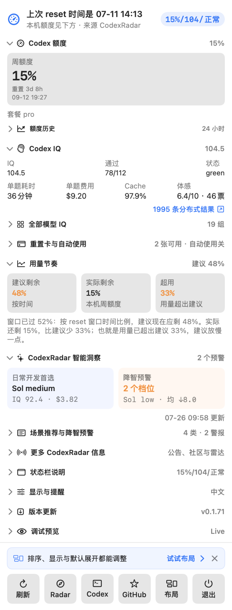

# Codex Radar Sentinel

中文 | [English](README.en.md)

一个面向 macOS 13 及以上版本的菜单栏工具：把本机 Codex 额度、用量节奏、重置卡状态，以及 [CodexRadar](https://codexradar.com/) 的公开模型质量与雷达信号集中到一个紧凑、可配置的下拉面板中。


[最新版本](https://github.com/WineChord/codex-radar/releases/latest) · [功能概览](#核心功能) · [隐私与安全](#隐私与安全) · [从源码运行](#从源码运行)

## 让 Codex 帮你安装

> **推荐方式：** 把下面这段文字交给 Codex 桌面版，即可完成下载、校验、安装、启动和版本确认。

```text
请安装 Codex Radar Sentinel 的最新稳定版。
Release 页面：
https://github.com/WineChord/codex-radar/releases/latest
下载 macOS 安装包和 SHA256 校验文件，校验通过后将应用安装到 /Applications，启动应用，并确认菜单栏中显示的版本与最新 Release 一致。遇到需要我处理的 macOS 权限提示时，请说明用途后让我确认。
```

安装需要网络访问和 `/Applications` 写入权限。首次启动时，macOS 可能询问通知权限；允许后才能收到额度、Model IQ 和重置卡自动使用提醒。

不使用 Codex 也可以直接前往 [GitHub Releases](https://github.com/WineChord/codex-radar/releases/latest) 手动安装。

## News / 最新功能

### v0.1.61：“布局”入口更容易发现

- 面板底部新增一条轻量提示，说明模块顺序和默认展开都能调整；点击“试试布局”会直接进入布局编辑器。
- 从提示或底部“布局”进入后，提示不会重复出现；也可以直接关闭，选择会在应用重启后保留。
- 提示只出现一次且不占用顶部空间，当前结论、关键告警和常用数据的优先级保持不变。

### v0.1.60：模块内子项也能预设展开

- 布局编辑器会在所属模块下方列出可折叠子项；现在可以直接设置“全部模型 IQ”和“场景推荐与降智预警”是否默认展开。
- 子项开关与主菜单中的实际展开状态使用同一份偏好，重新打开菜单和重启应用后都会保留。
- “恢复默认布局”会同时重置顶层模块与子项；以后新增的同类子项也会沿用一致的分层入口。

### v0.1.59：菜单布局按习惯调整

- 默认层级继续优先展示当前结论、本机额度、Codex IQ、重置卡摘要和用量节奏，常用信息无需先翻找设置。
- 点击底部“布局”即可拖动模块，或使用上移、下移按钮调整顺序，并分别设置默认展开状态；选择会在重新打开菜单和重启应用后保留。
- 当前结论、紧急提示和连接错误始终固定可见；需要处理的重置卡或更新状态会临时展开，也可以一键恢复默认布局。

<details>
<summary><strong>历史版本</strong> — 展开查看更早的产品里程碑</summary>

- **v0.1.58**：让多模型 IQ 的通过数在 M/L/XL 字号下保持完整，并让 SHA256 清单可在下载目录直接校验。
- **v0.1.57**：将核心额度与 Codex IQ 前置，把低频信息统一收进清晰的折叠入口，同时保持关键告警可见。
- **v0.1.56**：兼容没有临时公告的正常空状态，公告变化不再影响其他在线数据更新。
- **v0.1.55**：加入场景推荐与降智预警，并在网络或数据格式异常时保留上一次有效结果。
- **v0.1.54**：避免正常系统校时误关重置卡自动使用，并让未决请求优先只读对账。
- **v0.1.53**：补齐 19 组智力效率数据，改善“超用”表达，并加入默认关闭、需要明确确认的重置卡到期前自动使用。
- **v0.1.52**：接入分布式 Model IQ，统一单题费用、耗时、通过数和社区体感口径。
- **v0.1.51**：5h 短窗暂停时自动隐藏，恢复后自动出现。
- **v0.1.50**：加入 Standard 与 Fast 的 E2E、TTFT、TPS 对比。
- **v0.1.49–v0.1.45**：完善社区知识卡、官方窗口识别、本机额度定位、恢复提醒和网站公告。
- **v0.1.44–v0.1.40**：统一长文本展开体验，并加入重置卡过期时间的手动与低频自动查询。
- **v0.1.39–v0.1.35**：完善重置卡查询入口、重置雷达、额度雷达和多模型 IQ 展示。
- **v0.1.34–v0.1.30**：增强数据兼容、工作日节奏、通知降噪和网络超时保护。
- **v0.1.29–v0.1.23**：增加费用、耗时、Cache、体感分，并改善折叠区交互。
- **v0.1.22–v0.1.17**：加入多种用量节奏策略和更紧凑的状态栏自定义。
- **v0.1.11–v0.1.0**：建立短窗显示、自动更新和首版菜单栏仪表盘等基础能力。

完整版本记录见 [GitHub Releases](https://github.com/WineChord/codex-radar/releases)。

</details>

## 核心功能

| 能力 | 作用 |
| --- | --- |
| 本机额度 | 显示 Codex 周额度；接口明确返回 5h 短窗时也可显示短窗额度。 |
| 用量节奏 | 对比当前实际剩余与建议剩余，直观提示“可多用”“接近节奏”或“超用”。 |
| Model IQ | 展示当前 IQ、质量状态，以及公开的多模型费用、耗时、通过数和体感分。 |
| 雷达信号 | 汇总重置雷达、额度雷达、Fast 雷达、场景推荐和降智预警。 |
| 重置卡状态 | 低频查询每张重置卡的状态与到期时间，只缓存脱敏结果。 |
| 到期前自动使用 | 严格默认关闭；明确开启后，才会在卡片临近到期时尝试使用目标卡。 |
| 通知与更新 | 提醒低额度、额度恢复、低 IQ 和自动使用结果；自动更新包会先校验 SHA256。 |
| 个性化 | 支持中英文、字体大小、菜单模块排序、默认展开状态、状态栏片段和显示格式。 |

## 状态栏含义

默认标题刻意保持简短：

```text
96%/112/正常
```

| 片段 | 含义 |
| --- | --- |
| `96%` | 本机 Codex 周额度剩余。 |
| `112` | Codex IQ；默认显示整数，下拉菜单保留精确值。 |
| `正常` | CodexRadar 的模型质量状态；IQ 偏低时显示 `低`。 |

还可以按需打开：

- `5h`：本机 Codex 返回 5 小时短窗时可用；短窗暂停时自动隐藏。
- `应剩`：显示当前时间点建议保留的周额度，例如 `应80%`。
- `状态栏 IQ 小数`：在菜单栏里保留精确 IQ。
- `状态栏高级`：调整分隔符、左右留白、字体比例、`/10` 样式和百分号。

## 状态展示

以下图片由应用在隔离预览环境中直接渲染，不包含真实账户数据或其他菜单栏内容。

| 正常 | IQ 偏低 | 本机限额 | 自定义 |
| --- | --- | --- | --- |
|  |  |  |  |

## 完整菜单



面板默认依次展示当前结论、本机额度、Codex IQ、重置卡摘要、用量节奏和智能洞察。公告、社区知识、雷达明细和低频设置默认折叠，需要时仍可在原位展开；关键告警保持可见，需要处理的重置卡或更新状态会自动展开。刷新、Radar、Codex、GitHub、布局和退出入口固定在底部；首次展示布局功能时，工具栏上方会显示一条可关闭的轻提示。

## 使用说明

### 菜单布局

点击底部 `布局` 可调整顶层模块：拖动手柄或使用上移、下移按钮改变顺序，并为每项选择是否默认展开。模块内还有可折叠子项时，会在所属模块下方缩进显示，例如 `Codex IQ` 下的 `全部模型 IQ`；子项也可以独立设置默认展开。所有选择都会在重新打开菜单和重启应用后保留。`恢复默认布局` 只重置这些布局偏好，不会改变语言、字号、提醒或自动更新设置。

首次显示时，底部工具栏上方会用一条轻提示说明布局能力。点击提示会直接进入布局编辑器；直接点击 `布局` 或关闭提示后，它都不会重复出现。

当前结论、紧急提示和连接错误不参与排序。重置卡或更新遇到需要处理的状态时，对应模块会临时锁定展开；问题解除后恢复用户原来的折叠偏好。

### 用量节奏

`应剩计算策略` 默认折叠，点击整行即可展开并切换：

- `按时间`：在整个 reset 窗口内平滑使用。
- `每日`：按本机日历的天级预算推进。
- `留余`：前期保留 20% 缓冲。
- `工作日`：工作日多用、周末和法定节假日少用。
- `先用`：前半程更积极，降低 reset 前剩余过多的概率。

节奏卡片使用无符号百分比表达方向。例如实际用量比建议多 33% 时显示 `超用 33%`，不会显示容易误读的负数。

### 重置卡与到期前自动使用

`重置卡与自动使用` 默认折叠，并在折叠行显示可用数量或当前执行状态。展开后可查看完整明细、开关和恢复操作。重置卡到期时间会在应用启动后或缓存超过 6 小时时低频刷新，也可以关闭自动查询或手动刷新；查询失败时会保留旧缓存，并给出未登录、登录过期、网络或数据格式等可操作提示。

`重置卡到期前自动使用` 是独立开关，并且严格默认关闭。开启前会展示不可撤销说明并要求明确确认；启用后只覆盖确认时可见、受支持且有明确到期时间的卡片。计划检查是只读操作，不会消耗卡。

只有最早到期的目标卡距离到期约 30 分钟时，应用才会自动尝试使用。账号、卡片集合或时间连续性发生无法安全确认的变化时，该功能会自动关闭。断网、关机、休眠、退出应用或服务端没有可重置用量都可能导致未执行，因此这是尽力执行的功能，而不是绝对保证；建议同时开启 `登录时启动`。

### 通知

应用可在以下情况发送 macOS 通知：

- 周额度低于 30% 或 15%。
- 周额度从低位恢复。
- Codex IQ 进入 red 或低于 80。
- 重置卡自动使用成功，或需要检查账号、授权卡片、时间连续性和未决结果。
- 兼容接口未来重新报告明确的旧版窗口或 reset 事件。

通知声音默认关闭，可在菜单中单独开启。

### 更新

自动更新默认开启。应用启动后会检查一次，之后每 6 小时检查最新 GitHub Release。下载完成后先校验发布资产中的 SHA256，再替换应用并重新启动。

更新失败时保留当前版本并显示原因；同一版本的自动重试会短暂冷却，`检查更新` 仍可立即手动重试。

## 隐私与安全

- 本机额度通过本地 Codex app-server 读取，不会上传到 CodexRadar。
- 重置卡到期查询需要使用本机 Codex 登录态访问 ChatGPT 对应接口；凭证只用于该请求，不会写入缓存、日志或发送给 CodexRadar、GitHub。
- 本地缓存只保存卡片状态、发放时间、到期时间和脱敏标识，不保存访问令牌、Cookie、邮箱或完整卡片 ID。
- 到期前自动使用只在明确开启后工作，并将授权绑定到当时的账号与卡片集合。每次写入前会再次核对目标、授权和时间连续性。
- 不确定的执行结果会优先只读对账；同一次未决操作使用同一个幂等键，避免重复使用。
- 关闭自动使用后，不会继续重试或切换到其他卡片。重新开启前必须先确认上一笔未决结果。

## 数据来源

- [CodexRadar 首页](https://codexradar.com/)：公告、重置雷达、社区知识、额度雷达和模型质量摘要。
- [CodexRadar current.json](https://codexradar.com/current.json)：公开权益事件、Model IQ、额度雷达和兼容字段。
- [CodexRadar 智力效率数据](https://codexradar.com/data/intelligence-efficiency.json)：多模型 IQ、费用、耗时和通过数。
- [CodexRadar 社区体感数据](https://codexradar.com/api/model-ratings)：模型社区评分。
- [CodexRadar 智能洞察](https://api.codexradar.com/api/v1/radar-insights)：场景推荐和降智预警。
- [CodexRadar RSS](https://codexradar.com/feed.xml)：公开权益事件的兼容来源。
- 本机 Codex app-server：周额度、短窗额度、登录身份和重置卡自动使用所需的权威明细。

公开端点暂时不可用或返回未知格式时，应用会保留最后一次有效数据，并让本机额度继续独立刷新。

## 手动安装

1. 从 [最新 GitHub Release](https://github.com/WineChord/codex-radar/releases/latest) 下载 `.dmg`。
2. 打开镜像，把 `Codex Radar Sentinel.app` 拖到 `Applications`。
3. 启动应用，在菜单的版本更新区确认版本号。

`.zip` 包含同一个应用，适合需要自行复制或自动化安装的场景。

## 从源码运行

构建普通 macOS 应用：

```bash
./scripts/build_app.sh
open ".build/Codex Radar Sentinel.app"
```

开发时也可以直接运行：

```bash
swift run CodexRadarSentinel
```

如果 Codex 不在默认位置：

```bash
CODEX_RADAR_CODEX_PATH=/path/to/codex swift run CodexRadarSentinel
```

## 开发与验证

```bash
swift test
swift build -c release
./scripts/check_release_readiness.sh 0.1.61
```

构建发布包：

```bash
./scripts/build_app.sh
./scripts/package_release.sh 0.1.61
```

更新中英文状态栏与菜单截图：

```bash
./scripts/update_readme_screenshots.sh
```

截图脚本使用隔离的非实时预览，不读取真实账户数据，也不会改变正在运行的正式应用设置。

## 鸣谢

感谢 [CodexRadar](https://codexradar.com/) 持续提供公开的 Codex 雷达、模型质量和社区信号。本应用将这些公开信息与本机 Codex 状态整合为一个 macOS 菜单栏界面。

Codex Radar Sentinel 与 CodexRadar 或 OpenAI 没有关联。
